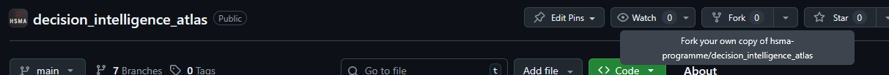
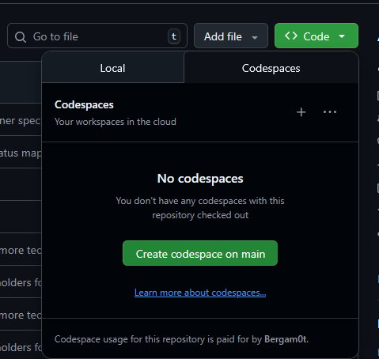

**Welcome to the Healthcare Services Analytics & Decision Science Atlas. This is a directory of open-source tools, packages, and projects for analytics and decision science in healthcare.**

This site is in its very early stages - please check back as we continue to develop it.

In time, we hope this can develop into a tool to help showcase the amazing work happening across the analytics and data science communities in healthcare, promoting reuse and collaborative work on the tools we all need.

## Contributors

<!-- ALL-CONTRIBUTORS-LIST:START - Do not remove or modify this section -->
<!-- prettier-ignore-start -->
<!-- markdownlint-disable -->
<table>
  <tbody>
    <tr>
      <td align="center" valign="top" width="14.28%"><a href="https://sammirosser.com"> <b>Sammi Rosser</b></a> <a href="#code-Bergam0t" title="Code">💻</a> <a href="#content-Bergam0t" title="Content">🖋</a> <a href="#design-Bergam0t" title="Design">🎨</a> <a href="#ideas-Bergam0t" title="Ideas, Planning, & Feedback">🤔</a> <a href="#infra-Bergam0t" title="Infrastructure (Hosting, Build-Tools, etc)">🚇</a> <a href="#maintenance-Bergam0t" title="Maintenance">🚧</a> <a href="#review-Bergam0t" title="Reviewed Pull Requests">👀</a></td>
    </tr>
  </tbody>
</table>

<!-- markdownlint-restore -->
<!-- prettier-ignore-end -->

<!-- ALL-CONTRIBUTORS-LIST:END -->

## Contributing

Contributions are very welcome!

### Contributing a tool, package or project

#### via GitHub Issues (code-free approach!)

If you wish to submit a tool, package or project but are not confident with GitHub and Quarto (or you just have a simple submission to make), you can submit a GitHub issue via our template: [https://github.com/hsma-programme/decision_intelligence_atlas/issues/new/choose](https://github.com/hsma-programme/decision_intelligence_atlas/issues/new/choose)

This will collect all the required information and use it to automatically generate a new folder and file in the correct format, raising it as a 'pull request' for inclusion in the atlas. A repository administrator will then review the auto-created file, make any tweaks and fixes required, and let you know when your contribution is live.

#### Advanced option: contributing a .qmd file

If you wish to have more control over your submission and are comfortable using Quarto, you may wish to **take a fork of the repository**, make your changes, and then submit a pull request. Your request will be reviewed and merged, with additions or tweaks possible.

You can find a template .qmd file for adding a package, project or tool in the `templates/` folder.

Templates for other kinds of content will follow in the future.

To create your own entry:

1. Create a folder in `packages_projects_tools/` named after your tool. Use only letters, numbers, hyphens(`-`) or underscores (`_`); no spaces or other special characters.
    - Note that there are currently a lot of placeholders for various tools/packages/projects that @Bergam0t thinks should be added, which will just contain an empty file called `.gitkeep` that's used to tell GitHub to make the folder. You are very welcome to submit an entry for one of these! In that case, you just won't need to create a new folder - use the one that's already there.

2. Copy the template `.qmd` file from the `templates/` folder into your tool folder. Rename it to match the folder name, keeping the `.qmd` extension.

3. Add any additional resources (e.g., images, figs) to your folder. Use **relative links** in your `.qmd` file - for example:
    - Good: ``
    - Bad: ``
    - Bad: `!(my_tool/my_tool_example.png)`

4. Complete the YAML header, using the provided comments for guidance.

5. Write a description of the project outside the YAML header in the `.qmd` file.

6. Choose categories from `templates/packages_projects_tools_permitted_categories.csv`.
    - If no suitable category exists, add a new one in the YAML header and mention it in your pull request. An admin will review it and decide whether to add it to the list of categories.
    * Additionally, if your entry does not fit under the existing headers on the [atlas.hsma.co.uk/packages_tools_projects](atlas.hsma.co.uk/packages_tools_projects) page, please let us know in your pull request and an admin can look at adding a new section to this page. Please let us know if you have a section heading in mind.

To preview your entry locally, run `quarto render` to compile the website.  
The project currently uses Quarto version 1.7.33. You do **not** need to render the site manually for updates - deployment is handled automatically by GitHub Actions.

##### Using GitHub Codespaces

If you wish to avoid having to clone the repository to your local machine and set up Quarto, you may like to try editing in GitHub codespaces. All GitHub accounts have a fairly generous free number of minutes available for codespace usage per month.

Take a fork as normal using the fork button on the repository.

Click on `<> Code`, then go to the `Codespaces` tab and select `Create codespace on main`.

It will take a few minutes, but you should then be presented with a web-based version of VSCode with the repository cloned and the appropriate version of Quarto pre-installed. You can then use the built-in GitHub features of the web-based VSCode to commit your changes to your fork and make a pull request when you are ready.

### Contributing a technique or graph example

Templates for these types of contributions have not yet been set up - please check back soon!

Alternatively, if you're up for the challenge of creating a template, please do feel free to raise an issue to discuss or create a pull request with your proposal.

### Making other suggestions

If you have any other suggestions about the website layout, content, or anything else, please [raise an issue]() on the repository.

### Getting recognition

When your pull request is merged, you will be added to the contributors list by the pull request reviewer.

Reviewers: see guidance on [allcontributors.org/docs/en/bot/usage](https://allcontributors.org/docs/en/bot/usage)

You may also be added for other reasons, like providing valuable input via issues or discussions.
