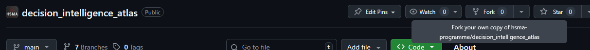
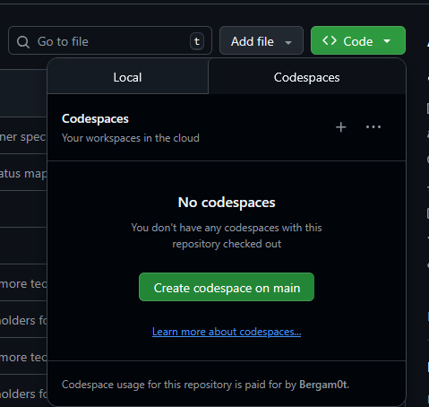

[](#contributors)

**Welcome to the Healthcare Services Analytics & Decision Science Atlas. This is a directory of open-source tools, packages, and projects for analytics and decision science in healthcare.**

This site is in its very early stages - please check back as we continue to develop it.

In time, we hope this can develop into a tool to help showcase the amazing work happening across the analytics and data science communities in healthcare, promoting reuse and collaborative work on the tools we all need.

## Contributors

<!-- ALL-CONTRIBUTORS-LIST:START - Do not remove or modify this section -->
<!-- prettier-ignore-start -->
<!-- markdownlint-disable -->
<table>
  <tbody>
    <tr>
      <td align="center" valign="top" width="14.28%"><a href="https://sammirosser.com"><br /><sub><b>Sammi Rosser</b></sub></a><br /><a href="#code-Bergam0t" title="Code">💻</a> <a href="#content-Bergam0t" title="Content">🖋</a> <a href="#design-Bergam0t" title="Design">🎨</a> <a href="#ideas-Bergam0t" title="Ideas, Planning, & Feedback">🤔</a> <a href="#infra-Bergam0t" title="Infrastructure (Hosting, Build-Tools, etc)">🚇</a> <a href="#maintenance-Bergam0t" title="Maintenance">🚧</a> <a href="#review-Bergam0t" title="Reviewed Pull Requests">👀</a></td>
      <td align="center" valign="top" width="14.28%"><a href="https://www.linkedin.com/in/amyheather"><br /><sub><b>Amy Heather</b></sub></a><br /><a href="#code-amyheather" title="Code">💻</a> <a href="#content-amyheather" title="Content">🖋</a> <a href="#doc-amyheather" title="Documentation">📖</a> <a href="#design-amyheather" title="Design">🎨</a> <a href="#maintenance-amyheather" title="Maintenance">🚧</a></td>
      <td align="center" valign="top" width="14.28%"><a href="http://www.personalboardroom.com"><br /><sub><b>Zella King</b></sub></a><br /><a href="#bug-zmek" title="Bug reports">🐛</a></td>
      <td align="center" valign="top" width="14.28%"><a href="https://github.com/paddy-devan"><br /><sub><b>padawan</b></sub></a><br /><a href="#content-paddy-devan" title="Content">🖋</a></td>
      <td align="center" valign="top" width="14.28%"><a href="https://github.com/ReyTan8"><br /><sub><b>ReyTan8</b></sub></a><br /><a href="#content-ReyTan8" title="Content">🖋</a></td>
    </tr>
  </tbody>
</table>

<!-- markdownlint-restore -->
<!-- prettier-ignore-end -->

<!-- ALL-CONTRIBUTORS-LIST:END -->

## Contributing

Contributions are very welcome!

### Getting involved in discussions

Interested in discussing some aspect of the Atlas? Got an opinion on how it should be structured, the sort of thing it should showcase, how it's laid out, or the branding? For these higher-level discussions, head over to the [discussions](https://github.com/hsma-programme/decision_intelligence_atlas/discussions) tab of our GitHub.

### Raising Issues

Spotted a bug? Got an idea for a potential improvement?

Please head over to our [issues](https://github.com/hsma-programme/decision_intelligence_atlas/issues) page and open a new issue - or see if you can contribute to any of the ones already open.

### Contributing a tool, package or project

#### via GitHub Issues (code-free approach!)

If you wish to submit a tool, package or project but are not confident with GitHub and Quarto (or you just have a simple submission to make), you can submit a GitHub issue via our template: [https://github.com/hsma-programme/decision_intelligence_atlas/issues/new/choose](https://github.com/hsma-programme/decision_intelligence_atlas/issues/new/choose)

This will collect all the required information and use it to automatically generate a new folder and file in the correct format, raising it as a 'pull request' for inclusion in the atlas. A repository administrator will then review the auto-created file, make any tweaks and fixes required, and let you know when your contribution is live.

#### Advanced option: contributing a .qmd file

If you wish to have more control over your submission and are comfortable using Quarto, you may wish to **take a fork of the repository**, make your changes, and then submit a pull request. Your request will be reviewed and merged, with additions or tweaks possible.

You can find a template .qmd file for adding a package, project or tool in the `templates/` folder.

Templates for other kinds of content will follow in the future.

##### Creating a new entry

To create your own entry:

1. Create a folder in `packages_projects_tools/` named after your tool. Use only letters, numbers, hyphens(`-`) or underscores (`_`); no spaces or other special characters.
    - If your entry is a book, course, tutorial, other training resource or community, create the folder in `books_training/` instead. It uses the same template and conventions. Tag it with `Courses and Training or Reference Materials`, plus **exactly one** of the following to choose where it appears on the [Books, Training and Communities](https://atlas.hsma.co.uk/books_training/) page:
        - `Books` - Books section. Books are listed as healthcare-specific by default; also add `General Open Analytics` if the book isn't specific to healthcare.
        - `Courses`, `Interactive Learning Tools`, `Reference Sites` or `Recorded Talks` (recorded webinars and conference talks) - the matching subsection of the Training section. `Courses` entries must also be tagged `Synchronous` (taught live at set times), `Asynchronous` (self-paced materials) or both, which shows as a tag on the course's card.
        - `Communities` - Communities section.
    - If a book has to be bought or needs a paid subscription to read, also tag it with `Paid Resources` so it appears in the 'Paid books' subsection, and add `<i class="fa-solid fa-sterling-sign" title="Paid resource"></i>` to its `project-type`.
    - Note that there are currently a lot of placeholders for various tools/packages/projects that @Bergam0t thinks should be added, which will just contain an empty file called `.gitkeep` that's used to tell GitHub to make the folder. You are very welcome to submit an entry for one of these! In that case, you just won't need to create a new folder - use the one that's already there.

2. Copy the template `.qmd` file from the `templates/` folder into your tool folder. Rename it to `index.qmd`.

3. Add any additional resources (e.g., images, figs) to your folder. Use **relative links** in your `.qmd` file - for example:
    - Good: ``
    - Bad: ``
    - Bad: `!(my_tool/my_tool_example.png)`

4. Complete the YAML header, using the provided comments for guidance.

5. Write a description of the project outside the YAML header in the `.qmd` file.

6. Choose categories from `templates/packages_projects_tools_permitted_categories.csv`.
    - If no suitable category exists, add a new one in the YAML header and mention it in your pull request. An admin will review it and decide whether to add it to the list of categories.
    * Additionally, if your entry does not fit under the existing headers on the [atlas.hsma.co.uk/packages_tools_projects](atlas.hsma.co.uk/packages_tools_projects) page, please let us know in your pull request and an admin can look at adding a new section to this page. Please let us know if you have a section heading in mind.

##### Editing an existing entry

You are also welcome to suggest edits to an existing entry via a pull request. Please look in the folder `packages_projects_tools/` (or `books_training/` for books, courses, training resources and communities) for a folder named after the tool you'd like to edit. Inside the folder, you'll find an `index.qmd` file - this is where you can make edits to the tags and details.

You can look at the URL to find out the filepath you need to look for.

e.g. The page for [Vidigi](https://atlas.hsma.co.uk/packages_projects_tools/vidigi.html) has the URL `https://atlas.hsma.co.uk/packages_projects_tools/vidigi.html`.

The file you need to edit is `packages_projects_tools/vidigi/index.qmd`

Additional images or other resources can be placed in the same folder and linked to.  Use **relative links** in your `.qmd` file - for example:

- Good: ``
- Bad: ``
- Bad: `!(my_tool/my_tool_example.png)`

##### Previewing your new or edited content

To preview your entry locally, run `quarto preview` to compile and display website.

The project currently uses Quarto version 1.7.33.

> [!TIP]
> You do **not** need to render the site manually other than for the purpose of checking your page renders as expected - rerendering and deployment is handled automatically by GitHub Actions when your pull request is accepted.

##### Using GitHub Codespaces

If you wish to avoid having to clone the repository to your local machine and set up Quarto, you may like to try editing in GitHub codespaces. All GitHub accounts have a fairly generous free number of minutes available for codespace usage per month.

Take a fork as normal using the fork button on the repository.



Click on `<> Code`, then go to the `Codespaces` tab and select `Create codespace on main`.



It will take a few minutes, but you should then be presented with a web-based version of VSCode with the repository cloned and the appropriate version of Quarto pre-installed. You can then use the built-in GitHub features of the web-based VSCode to commit your changes to your fork and make a pull request when you are ready.

### Contributing a technique or graph example

Templates for these types of contributions have not yet been set up - please check back soon!

Alternatively, if you're up for the challenge of creating a template, please do feel free to raise an issue to discuss or create a pull request with your proposal.

### Adding YouTube recordings

The Atlas lists recordings of conference talks, webinars, workshops and lectures from several YouTube playlists. Each set of recordings has its own Atlas entry with a searchable table of talks (for example, [NHS-OA Community: Conference Recordings](https://atlas.hsma.co.uk/books_training/nhs_oa_conference_recordings/)), and all of them are combined in the [Recordings Finder](https://atlas.hsma.co.uk/recordings/).

Don't want to touch the code? [Raise an issue](https://github.com/hsma-programme/decision_intelligence_atlas/issues/new/choose) with a link to the playlist or channel, and we'll add it for you.

#### How it fits together

* `resources/recordings/collections.yml` lists every **collection** of recordings. Each collection belongs to one Atlas entry, and lists the YouTube playlists (or individual videos) it contains.
* `resources/scripts/fetch_youtube_playlists.py` uses the YouTube Data API to fetch the title, description, date and thumbnail of every video, writing them to a `videos.json` file in each collection's entry folder.
* `resources/scripts/build_youtube_talks.py` turns each `videos.json` into a `talks.yml` file, with one row per talk, which is shown as a searchable table on the entry. It also writes `recordings/recordings.json`, which the Recordings Finder reads.
* The **Update YouTube recordings** GitHub Action runs both scripts for every collection on the 1st of each month, commits any changes and republishes the site, using the Atlas's API key stored as a repository secret. It can also be [run by hand](#option-1-run-the-github-action-no-api-key-of-your-own-needed), e.g. straight after a conference.

#### Adding a playlist to an existing collection

For example, to add next year's conference recordings, add the playlist to the collection's `playlists` in `resources/recordings/collections.yml`:

```yaml
nhs_oa_conferences:
  folder: books_training/nhs_oa_conference_recordings
  source: NHS-OA Community
  playlists:
    - label: RPySOC 2026
      id: PLxxxxxxxxxxxxxxxxxxxxxxxxxxxxxxxx
      type: Conference talk
    # ...existing playlists
```

The playlist ID is the part of the playlist's URL after `list=`. Playlists are listed on the entry and in the Recordings Finder in the order they appear in the file, so put the newest first.

Then [fetch and build the recordings](#fetching-and-building-the-recordings), and preview the entry and the Recordings Finder.

#### Adding a new collection

1. **Create the Atlas entry.** Create a folder in `books_training/` and an `index.qmd` file, following the [instructions for creating a new entry](#creating-a-new-entry). Tag it with `Courses and Training or Reference Materials` and either:

    * `Recorded Talks`, for talks, webinars and conference recordings, so it appears in the 'Recorded webinars and conference talks' section of the Books, Training and Communities page, or
    * `Courses` and `Asynchronous`, for recorded training courses or workshops that can be followed at your own pace (e.g. `books_training/mdsn_training`), so it appears with the other courses.

    Recordings can also be added to an existing entry instead, such as training videos for a tool - for example, the New Hospital Programme Demand Model entry in `packages_projects_tools/new_hospital_programme` has a table of its training recordings. If the entry's folder isn't in `books_training/`, `packages_projects_tools/` or `recordings/`, also add it to the `git add` line in `.github/workflows/update-youtube-recordings.yml`, or the monthly refreshes of its recordings won't be committed.

    Add a listing to the entry's YAML header to show the table of talks:

    ```yaml
    listing:
      - id: talk-recordings
        contents: talks.yml
        type: table
        fields: [title, year, description]
        field-display-names:
          title: "Talk"
          year: "Year"
          description: "Details"
        sort: "date desc"
        filter-ui: [title, year, description]
        sort-ui: [title, year]
        page-size: 25
    ```

    and show it in the body of the entry:

    ```
    ## Search the talks

    ::: {#talk-recordings}
    :::
    ```

    If the collection has more than one playlist, you can add `event` to `fields` to show each playlist's label (e.g. the conference or round), and use `sort: false` to keep the order from `collections.yml`. See the existing recording entries, such as `books_training/nhs_oa_conference_recordings/index.qmd`, for examples.

2. **Add the collection** to `resources/recordings/collections.yml`:

    ```yaml
    my_new_collection:
      folder: books_training/my_new_collection
      source: Name of the community or organisation
      playlists:
        - label: Webinars
          id: PLxxxxxxxxxxxxxxxxxxxxxxxxxxxxxxxx
          type: Webinar
    ```

3. **Add the entry to the Sources list** at the bottom of `recordings/index.qmd`.

4. **[Fetch and build the recordings](#fetching-and-building-the-recordings)**, then preview the new entry and the Recordings Finder, and [check for duplicates](#duplicates) of talks already in the Atlas.

If you don't have a YouTube API key, you can still build: the build script will create an empty table for the new collection. Its videos can then be fetched by [running the GitHub Action](#option-1-run-the-github-action-no-api-key-of-your-own-needed) on your branch, or will be fetched by the monthly run once your pull request is merged.

#### Collection options

Each collection in `collections.yml` has:

| Option | Required? | Description |
|---|---|---|
| `folder` | Yes | The folder of the collection's Atlas entry. |
| `source` | Yes | Who published the recordings, shown in the Recordings Finder's Source column and filter. Collections from the same community should use the same source. |
| `playlists` | Yes | The playlists in the collection (see below). |
| `exclude_playlists` | No | Leave out any videos that are also in these playlists, e.g. to avoid listing the same talk in two collections. |
| `exclude_videos` | No | Leave out these videos, e.g. promotional videos or untitled recordings. |

Each playlist has the following options. Most are only needed to tidy up playlists whose titles or descriptions are messy, so start with `label`, `id` and `type`, then check the built table and add others if needed.

**What to fetch**

| Option | Required? | Description |
|---|---|---|
| `id` | Yes, unless using `videos` | The YouTube playlist ID, or a list of IDs to combine several playlists under one label (e.g. separate playlists for each day or room of a conference). To include all of a channel's uploads, use its uploads playlist ID: its channel ID with `UC` at the start replaced by `UU`. |
| `videos` | No | A list of video IDs to include in place of a playlist, e.g. to pick a few videos out of a larger playlist. |

**How the videos are labelled**

| Option | Required? | Description |
|---|---|---|
| `label` | Yes | The playlist's name, shown in the Event column when a collection has more than one event. Must be unique within the collection. If it contains a year (e.g. `RPySOC 2025`), that year is used for all of its videos on the collection's entry; otherwise each video's upload date is used. See [Years and dates](#years-and-dates). |
| `event` | No | The event shown for the playlist's videos, in place of one taken from the label, e.g. so that extra videos added with `videos` are shown as part of the same series. |
| `events_by_title` | No | For playlists covering several courses or series: a list of `pattern` (a regular expression) and `event`. Videos whose titles match a pattern get that event (e.g. the course name) instead of one taken from the label, shown in the Event column. |
| `type` | Yes | The kind of recording (e.g. `Conference talk`, `Webinar`, `Workshop`, `Lecture`), shown in the Recordings Finder's Type column and filter. Reuse an existing type where one fits. |
| `types_by_title` | No | For playlists mixing different kinds of recording: a list of `pattern` (a regular expression) and `type`. Videos whose titles match a pattern get that type instead. |
| `no_year` | No | Set to `true` to leave the year blank on the collection's entry, e.g. where videos were uploaded long after the event. This doesn't affect the Recordings Finder, which always shows the YouTube publish date - see [Years and dates](#years-and-dates). |

**Tidying titles and descriptions**

| Option | Required? | Description |
|---|---|---|
| `remove_from_title` | No | A regular expression removed from each video's title, e.g. `'^INSIGHT 2020:\s*'` to remove a prefix repeated in every title. Use single quotes in the YAML for patterns containing backslashes. |
| `remove_from_description` | No | A list of regular expressions. Paragraphs of each video's description that match any of them are removed, e.g. an introduction to the event series repeated in every description. |
| `title_from_description` | No | Set to `true` to use the first line of each video's description as its title, for playlists whose video titles are cluttered or cut short (e.g. `HACA2025 - Day 1 - Main Stage`) but whose descriptions start with the talk title. |

**Leaving videos out**

| Option | Required? | Description |
|---|---|---|
| `exclude_by_title` | No | A list of regular expressions. Videos whose titles match any of them are left out, e.g. regular admin sessions that will keep being added to the playlist. |

**Splitting recordings into talks**

| Option | Required? | Description |
|---|---|---|
| `talk_list` | No | Set to `true` if session recordings list their talks one per line without timestamps (see below). |

Notes on the options that take regular expressions:

* All patterns ignore case.
* For `types_by_title` and `events_by_title`, the first rule whose pattern matches is used, so put more specific patterns first.
* `exclude_by_title`, `types_by_title` and `events_by_title` match the video's **original** title on YouTube, before `remove_from_title` or `title_from_description` change it.
* In YAML, put patterns containing backslashes in single quotes (e.g. `'^INSIGHT 2020:\s*'`), as double quotes treat backslashes as escape characters.

#### How recordings are split into talks

Some recordings cover a whole session or day with several talks. Where a recording's description lists the talks, `build_youtube_talks.py` splits it into one row per talk:

* **Timestamps**, such as `34:23 Speaker - Talk title`, `1:02:03 Talk title` or `1. (0:30) Talk title`, become separate rows whose links start the video at that talk.
* **Programme times**, such as `09:30 Speaker - Talk title`, are times of day rather than positions in the video, so their rows link to the start of the recording.
* **Plain lists of talks**, one per line with no times, are split into rows for playlists with `talk_list: true`, linking to the start of the recording.

Recordings that don't list their talks are kept as one row. If a recording isn't split as you'd expect, check its description on YouTube - the best fix is usually to add timestamps to the description there, which also gives viewers chapters to jump between.

#### Years and dates

The collection entries and the Recordings Finder date recordings differently:

* **Collection entries show a year.** It comes from the playlist's `label` if it contains one (e.g. `RPySOC 2025`), or otherwise from the year each video was uploaded. It's left blank for playlists with `no_year: true`.
* **The Recordings Finder shows the date each recording was published on YouTube**, and its slider filters on that date. This is the only date available for every recording, so `label` years and `no_year` don't affect it.

Most recordings are published within a few weeks of the event, so the two usually agree, but watch out for:

* **Recordings uploaded long after the event**, which show their upload date in the Recordings Finder, even if their year is blank on their entry. For example, HSMA project showcases from earlier rounds show when they were uploaded, rather than when the round ran.
* **Events late in the year whose recordings were published early the following year.** For example, RPySOC 2025 talks show 2025 on their entry, but January 2026 in the Recordings Finder.

If a collection's dates could mislead, say so on its entry, e.g. "These recordings were uploaded in 2022, after HSMA 4 ran".

#### Duplicates

The same talk is often in more than one playlist, e.g. conference workshops that are also in a community's workshop playlist. Some duplicates are removed automatically:

* **The same video in more than one playlist of a collection** is only listed once, in the first of those playlists in `collections.yml`.
* **The same talk in more than one collection** is listed on each collection's entry, so each entry shows its whole collection, but only once in the Recordings Finder, under the first of those collections in `collections.yml`. A talk counts as the same if it has the same link and title.

Others need to be left out by hand, with `exclude_videos` or `exclude_playlists`:

* **The same talk uploaded more than once**, as separate videos with different IDs.
* **The same video with different titles in different collections**, e.g. because only one of them uses `remove_from_title` or `title_from_description`.

After building, you can check the Recordings Finder for links listed more than once with:

```
python -c "import json, collections; c = collections.Counter(r['url'] for r in json.load(open('recordings/recordings.json', encoding='utf-8'))); print([u for u, n in c.items() if n > 1])"
```

Links listed more than once aren't always a problem: talks split from a session recording with `talk_list` all link to the start of the recording. Check whether the titles match before leaving anything out.

#### Fetching and building the recordings

Fetching the videos' details from YouTube needs a YouTube Data API key. There are two ways to do it.

##### Option 1: run the GitHub Action (no API key of your own needed)

The **Update YouTube recordings** GitHub Action uses the Atlas's own API key, which is stored securely in the repository as the `YOUTUBE_API_KEY` secret. As well as running automatically on the 1st of each month, anyone with write access to the repository can run it by hand:

1. Go to the repository's **Actions** tab and choose **Update YouTube recordings** from the list of workflows.
2. Click **Run workflow**, choose the branch to run it on, and click the green **Run workflow** button.

The Action fetches every collection, builds the tables of talks, and commits any changes to the branch it was run on.

* Run on `main` (e.g. straight after a conference, to pick up new videos in an existing playlist), it also republishes the site.
* Run on another branch (e.g. the branch for a pull request adding a new collection), it commits the fetched recordings to that branch without publishing anything, so they can be reviewed before merging.

If you've contributed from a fork and don't have write access, you don't need to do anything - a maintainer will run the Action, or the monthly run will pick up your collection once your pull request is merged.

##### Option 2: run the scripts yourself

1. **Get an API key.** Keys are free. Create a project in the [Google Cloud Console](https://console.cloud.google.com/), enable the **YouTube Data API v3**, and create an API key under **APIs & Services > Credentials**. Under the key's **API restrictions**, restrict it to the YouTube Data API v3 only. Fetching every collection uses well under 1% of the free daily quota.

2. **Make the key available to the scripts**, as an environment variable called `YOUTUBE_API_KEY`. The simplest way is a `.env` file in the root of the project containing:

    ```
    YOUTUBE_API_KEY=your-key-here
    ```

    The scripts read this file automatically. Alternatively, set the environment variable in your terminal before running the scripts. This only lasts until you close the terminal:

    * Windows (PowerShell): `$env:YOUTUBE_API_KEY = "your-key-here"`
    * Windows (Command Prompt): `set YOUTUBE_API_KEY=your-key-here`
    * macOS or Linux: `export YOUTUBE_API_KEY=your-key-here`

    or set it permanently for your user account, e.g. on Windows by running `[Environment]::SetEnvironmentVariable("YOUTUBE_API_KEY", "your-key-here", "User")` in PowerShell and then restarting your terminal and code editor. If you're working in GitHub Codespaces, add the key as a [Codespaces secret](https://docs.github.com/en/codespaces/managing-your-codespaces/managing-your-account-specific-secrets-for-github-codespaces) called `YOUTUBE_API_KEY` instead.

3. **Fetch** the video details:

    ```
    python resources/scripts/fetch_youtube_playlists.py [collection ...]
    ```

    Give the names of the collections to fetch (e.g. `nhs_oa_conferences`), or leave them out to fetch all of them. This writes a `videos.json` file to each collection's folder.

4. **Build** the tables of talks. This doesn't need an API key:

    ```
    python resources/scripts/build_youtube_talks.py
    ```

Both scripts need the `pyyaml` package, which is included in the project's `environment.yaml`. Commit the updated `videos.json` and `talks.yml` files, and `recordings/recordings.json`, along with your other changes.

> [!WARNING]
> **Keep your API key secret.** Anyone with your key can use up its quota, and could run up costs if billing is enabled on your Google Cloud project.
>
> * **Never commit your key.** Don't put it in any of the Atlas's files except `.env`, which is ignored by git. To double-check before committing, run `git check-ignore .env` (which should print `.env`) and look through `git status` and `git diff` for your key.
> * Don't paste your key into issues, pull requests, discussions or chat tools - including AI assistants.
> * Don't use `--body` or similar to pass your key to command line tools, as it will be saved in your shell's history.
> * Restrict your key to the YouTube Data API v3 only, so it can't be used for anything else.
> * If you think your key has been exposed, delete it in the Google Cloud Console straight away and create a new one. Deleting a key from the repository's history doesn't make it safe again, as it may already have been copied.

### Making other suggestions

If you have any other suggestions about the website layout, content, or anything else, please [raise an issue]() on the repository.

### Getting recognition

When your pull request is merged, you will be added to the contributors list by the pull request reviewer.

Reviewers: see guidance on [allcontributors.org/docs/en/bot/usage](https://allcontributors.org/docs/en/bot/usage)

You may also be added for other reasons, like providing valuable input via issues or discussions.
