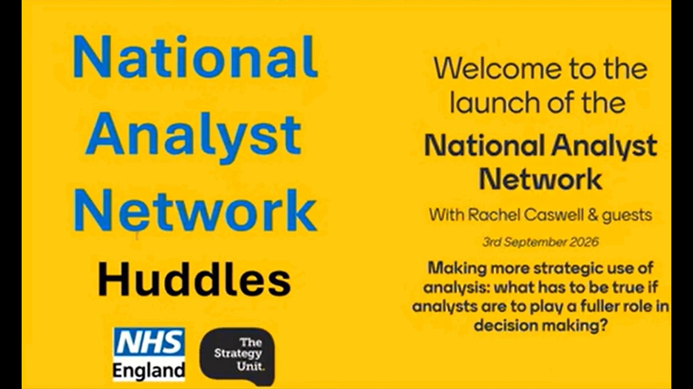

The Midlands Analyst Network was established in April 2020 to give analysts working in health and care across the Midlands a space to share information, ideas and resources, and to seek advice from one another. Hosted by the Strategy Unit, it grew to over 850 members, and in September 2026 relaunched as the National Analyst Network with NHS England.

The network runs a fortnightly online Huddle, which you don't need to be a member to attend. Each Huddle lasts around an hour, with a presentation from network members, academics, subject specialists or national organisations, and recordings are published on YouTube.

The Huddles cover a wide range of topics, including:

* **population health and inequalities** - such as health inequalities in the Midlands, socio-economic inequalities in heart disease, and inequalities in elective care
* **demand, capacity and waiting lists** - such as the 85% bed occupancy fallacy, waiting list pressures and queueing theory, and future demand for healthcare
* **analytical methods** - such as system dynamics, machine learning, forecasting, process mining, statistical process control and Making Data Count
* **tools and good practice** - such as RAP, Git and GitHub, data visualisation and accessibility, and assessing the quality of analysis
* **the analyst profession** - such as the National Competency Framework for Data Professionals, presenting analytical work, and the role of analysts in decision making

## Search the Huddles

Search for a Huddle by title, speaker, year or topic. Newest Huddles are listed first.

::: {#huddle-recordings}
:::

You can also browse the full [Huddle playlist on YouTube](https://www.youtube.com/playlist?list=PLFEXOtXX7YkmiOpE31JfMDBWidHAZROqR).

To search these recordings alongside talks, webinars and workshops from other communities, use the [Recordings Finder](/recordings/index.qmd).
