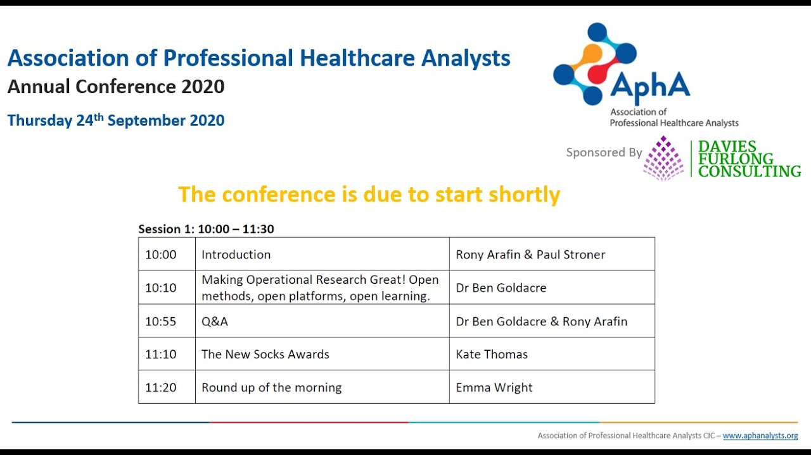

The [Association of Professional Healthcare Analysts (AphA)](/books_training/apha/index.qmd) is the professional membership body for health and care data and analytics professionals in the UK. Its YouTube channel has recordings of many of its online events, including:

* **Lunch & Learn webinars** - regular lunchtime sessions with speakers from across health and care, academia and industry, on topics such as regression and statistical analysis, data visualisation and storytelling, messy NHS data, the Federated Data Platform, secure data environments, large language models and the analytical workforce
* **Branch meetings** - meetings of AphA's regional branches, such as London, Yorkshire and the Humber, and the East of England, with talks from local analysts
* **Annual conferences** - recordings of the 2020 and 2021 AphA conferences, including Ben Goldacre on open methods and open platforms in 2020
* **Workshops and webinars** - including sessions on wellbeing and resilience, and on the hiring process for analysts

AphA's sessions about its own services, such as introductions to membership, professional registration and the mentoring programme, aren't listed here - see [AphA's website](https://www.aphanalysts.org) for details of these.

## Search the recordings

Search for a recording by title, speaker, year, series or topic. Newest recordings are listed first. Where a recording's description gives timings for its talks, each talk is listed separately and the link starts the video at that talk.

::: {#apha-recordings}
:::

You can also browse all of the videos on [AphA's YouTube channel](https://www.youtube.com/channel/UCJVrw1kIEyQmb1khi1nQSNQ/videos).

To search these recordings alongside talks, webinars and workshops from other communities, use the [Recordings Finder](/recordings/index.qmd).
