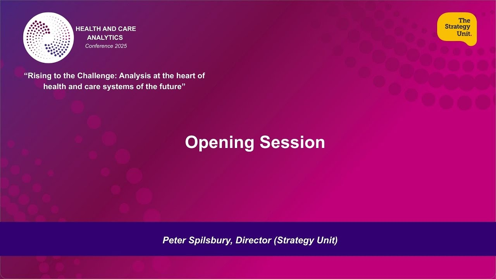

The Health and Care Analytics Conference (HACA) is the UK's national conference for analysts working in health and care. In its own words:

> HACA is the UK's leading analytics event for health and care, bringing together analysts, leaders, and decision-makers to connect, learn, and celebrate the impact of great analytical work.

It is run by [The Strategy Unit](https://www.strategyunitwm.nhs.uk/), and is open to analysts, leaders, decision-makers and others interested in analytics who work in health and care in the UK public sector, including the NHS, local authorities, the civil service, academia and the third sector. It has been free to attend for staff working in health and social care in the UK public sector.

HACA is a conference rather than an ongoing community, but it has quickly become one of the main places for the health and care analytics community to come together. Talks are chosen from abstracts submitted by analysts across the sector, so the programme gives a good picture of the analytical work going on across the UK. The first HACA was held at the University of Birmingham in 2023, and HACA 2025 was held online, with the theme *Rising to the challenge: Analysis at the heart of health and care systems of the future*.

## Recordings

Recordings of HACA 2023, 2024 and 2025 are available on YouTube, including:

* **Keynotes and panel discussions** - such as keynotes from Penny Dash, Sally Gainsbury and Jess Morley at HACA 2025
* **Talks** - on topics including waiting lists, health inequalities, demand and capacity modelling, simulation, machine learning, data linkage and reproducible analytical pipelines (RAP)
* **Workshops and E-labs** - longer, practical sessions, such as introductions to simulation and Quarto for managers at HACA 2025

### Search the talks

Search for a talk by title, speaker, year, event or topic. The newest conference is listed first. For HACA 2025, the event also shows the stage or stream the talk was part of.

::: {#haca-talks}
:::

You can also browse all of the videos on [HACA's YouTube channel](https://www.youtube.com/%40HACA_Conference/playlists).

To search these recordings alongside talks, webinars and workshops from other communities, use the [Recordings Finder](/recordings/index.qmd).
