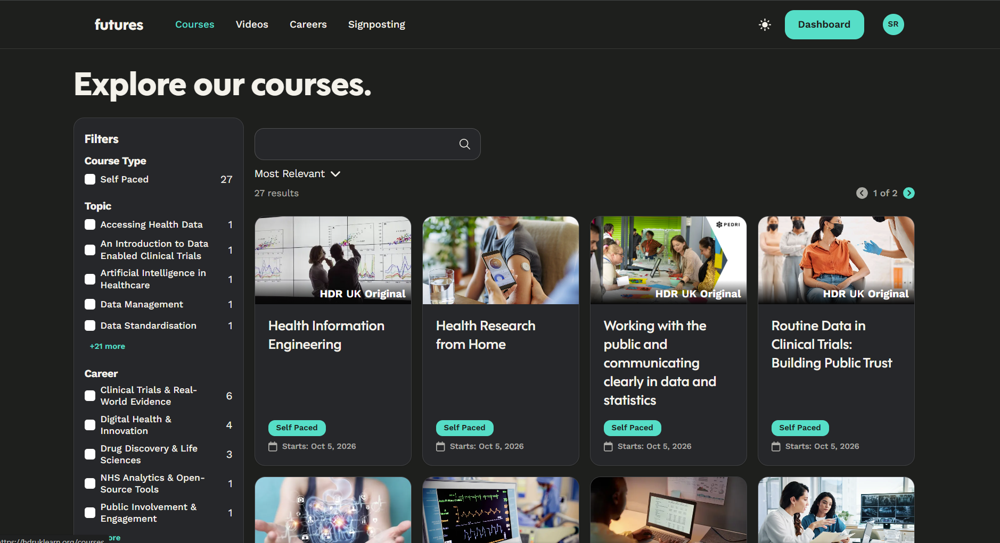

Futures is a free online learning platform from [Health Data Research UK (HDR UK)](https://www.hdruk.ac.uk), the UK's national institute for health data science. In its own words:

> Short videos, expert-led courses and live events - free to start, flexible to fit. Build the skills that healthcare and research need from you next.

It is aimed at a wide range of learners, from students, early-career researchers and career changers to NHS clinicians, allied health professionals, analysts and informaticians, and people working in industry. The platform suggests where to start based on your role.

Futures offers:

* **Expert-led courses** - structured, self-paced courses designed and delivered by researchers, clinicians and practitioners
* **Bite-sized videos** - over 100 short, focused videos
* **Signposted training** - a curated map of training from across the health data ecosystem
* **Events** - live events run by people from the NHS, industry and universities

The course catalogue changes over time, but examples of courses likely to be of interest to analysts and data scientists include:

* Accessing Health Data
* Databases for Health Data
* Research Software Engineering

Browse the [full list of courses](https://hdruklearn.org/) on the platform.

Most of the content is free to access, though you need to register for a free account. Courses are checked and approved by HDR UK.

::: {.callout-note}
While the courses themselves are free, for some modules you have to pay if you want a certificate of completion.
:::

## Visit the platform

To visit Futures, click on the image above or go to <https://hdruklearn.org/>.
