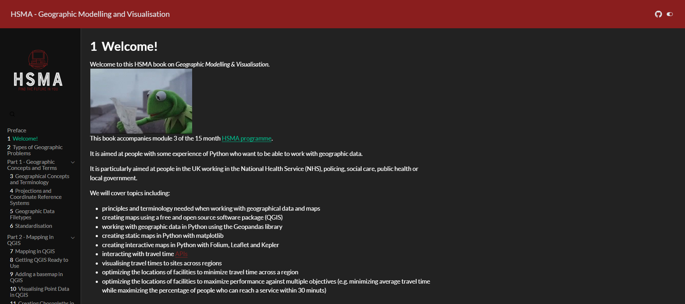

HSMA: Geographic Modelling and Visualisation is a free eBook written to accompany the [geographic modelling and visualisation module](/books_training/hsma_geographic_module/index.qmd) of the [Health Service Modelling Associates (HSMA) programme](/books_training/hsma_programme/index.qmd).

It is aimed at people with some experience of Python who want to be able to work with geographic data, and particularly at people in the UK working in the NHS, policing, social care, public health or local government.

The book is split into six parts:

1. Geographic concepts and terms, including projections, coordinate reference systems and geographic data filetypes
2. Mapping in QGIS, a free and open source point-and-click tool
3. Mapping in Python, with geopandas, matplotlib and folium
4. Working with travel times, including travel time APIs and isochrones
5. Facility location problems - finding the best places to put your services
6. Working with boundaries, including redrawing boundaries and multiobjective optimisation

## View the book

To view the book, click on the image above or go to <https://geographic.hsma.co.uk>.

 

:::{.callout-tip}

Brand new to Python? Consider starting with the [HSMA book of Python](/books_training/hsma_python_book/index.qmd) first:

<https://python.hsma.co.uk>

:::
