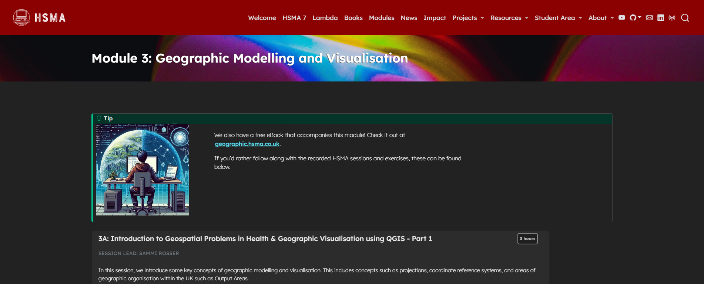

This module serves as an introduction to creating maps and solving geographical problems in Python.

The module begins with an overview of key geographic concepts, including projections, coordinate reference systems, and levels of geographic data in use within the UK.

It then moves on to the usage of the free program QGIS, allowing maps to be made in a powerful point-and-click tool without making use of code, before moving on to working with geographic data in Python.

It was delivered to the sixth cohort of the [Health Service Modelling Associates (HSMA) programme](/books_training/hsma_programme/index.qmd), a training course aimed at analysts, clinicians, managers and other people working in the NHS and related healthcare organisations.

It covers

- Loading in geographic data stored in a range of formats, including geoJSON, geopackages, shapefiles, and csv files, in QGIS
- Displaying point data and area data (creation of choropleths) in QGIS
- Enhancing QGIS maps with labels, custom colour groups, icons, and more
- Creating custom print layouts to display one or multiple QGIS maps along with titles, text and legends
- Loading in geographic data with the geopandas package in Python
- Converting pandas dataframes into geopandas dataframes
- Visualising point data and area data in static maps using matplotlib, and customising and polishing them
- Visualising point data and area data in interactive maps using folium
- Working with and visualising travel time matrices
- Obtaining travel time data for multiple modes of transport from free APIs using the routingpy package
- Obtaining and visualising isochrone data

The module ends with an exploration of how to solve geographic optimisation problems - placing a number of sites in a way that minimises an objective like average travel time or distance - in Python. The module gives code examples for brute force solutions, but also touches on more advanced evolutionary and genetic algorithm approaches and the value of multiobjective optimisation.

All slides, session recordings, code examples, exercises and exercise solutions are available to access on the module page, covering 12 hours of content.

## View the module

To view the module, click on the image above or go to <https://hsma.co.uk/hsma_content/modules/current_module_details/3_geographic_modelling_visualisation.html>.

 

:::{.callout-tip}

Prefer to learn by reading? The HSMA book of geographic modelling and visualisation covers the content of this module in written form:

<https://geographic.hsma.co.uk>

:::

:::{.callout-tip}

Brand new to Python? Consider starting with the HSMA book of Python first:

<https://python.hsma.co.uk>

:::
