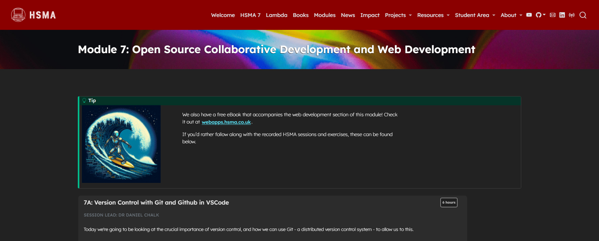

In this module we start by taking a look at a crucial skill for the analyst, data scientist or operational researcher's toolbox - version control with Git. Git ensures that the full history of your code is available, allowing you to roll back to earlier versions of code, and keep a clean working copy of code safe and accessible while being able to start working on new features.

We then explore the online platform GitHub, which allows for hosting of code folders that are controlled using Git, and is a crucial part of ensuring your code is available for others to audit, use and build on.

We then move on to creating web interfaces with the Streamlit framework - a beginner-friendly but powerful Python library for creating data-driven web apps and interactive model interfaces, getting your scripts into the hands of others without them having to install or use the code directly.

It was delivered to the sixth cohort of the [Health Service Modelling Associates (HSMA) programme](/books_training/hsma_programme/index.qmd), a training course aimed at analysts, clinicians, managers and other people working in the NHS and related healthcare organisations.

The Streamlit sessions cover

- creating simple apps
- adding interactive elements like sliders, text and numeric inputs, dropdowns, and more
- adding outputs such as dataframes, interactive plots, and maps
- theming your app
- using layout elements such as tabs, columns, expanders, sidebars, and multi-page navigation
- improving the running of your app with advanced features like caching, fragments and session state

The module rounds off by practising Git and GitHub skills, uploading apps to a GitHub repository so they can be hosted on the Streamlit Community Cloud platform.

All slides, session recordings, code examples, exercises and exercise solutions are available to access on the module page, covering 18 hours of content.

While it is intended to be run on your local machine using the supplied environment, some exercises can be completed online using the 'Open in GitHub Codespaces' links.

## View the module

To view the module, click on the image above or go to <https://hsma.co.uk/hsma_content/modules/current_module_details/7_git_and_web_development.html>.

 

:::{.callout-tip}

Prefer to learn by reading? The HSMA book of web apps covers the Streamlit content of this module in written form:

<https://webapps.hsma.co.uk>

:::

:::{.callout-tip}

Brand new to Python? Consider starting with the HSMA book of Python first:

<https://python.hsma.co.uk>

:::
