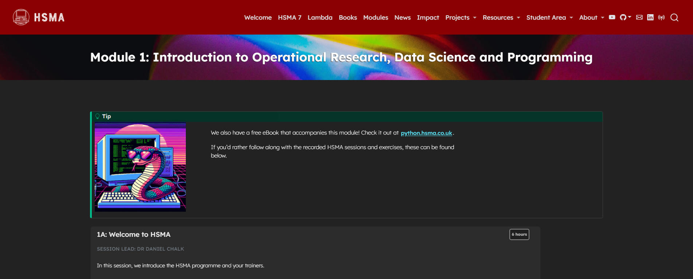

This module serves as an introduction to the fields of operational research and data science, as well as ensuring you have the tools setup and all of the Python knowledge you need to be able to access the later sessions delivered on the course.

It was delivered to the sixth cohort of the [Health Service Modelling Associates (HSMA) programme](/books_training/hsma_programme/index.qmd), a training course aimed at analysts, clinicians, managers and other people working in the NHS and related healthcare organisations.

It covers

- How the HSMA course is structured
- Why we should use Free and Open Source (FOSS) software
- What Operational Research and Data Science are
- The conceptual modelling process
- The concepts underpinning coding, such as conditional logic, the object oriented paradigm, and more
- How to set up the VSCode Integrated Development Environment (IDE) for Python Programming
- How to set up environments for package management throughout the HSMA course using Anaconda or the built-in environment features of VSCode
- How to write code using the Python programming language

All slides, session recordings, code examples, exercises and exercise solutions are available to access on the module page, covering 36 hours of content.

## View the module

To view the module, click on the image above or go to <https://hsma.co.uk/hsma_content/modules/current_module_details/1_intro_or_ds_python.html>.

 

:::{.callout-tip}

Prefer to learn by reading? The HSMA book of Python covers the same Python content in written form:

<https://python.hsma.co.uk>

:::
