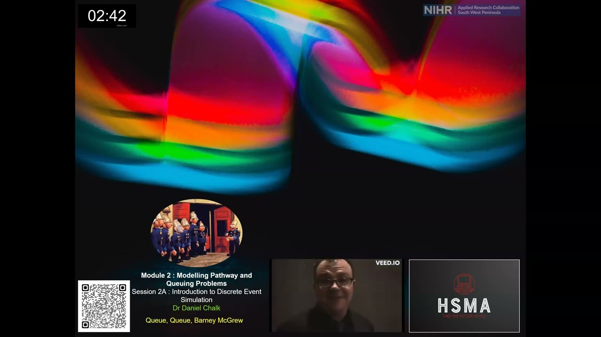

The [Health Service Modelling Associates (HSMA) programme](/books_training/hsma_programme/index.qmd) teaches its live lectures online, and records them for participants and anyone else who wants to learn. This entry brings together the recordings from four rounds of the programme, plus standalone workshops and masterclasses:

* **Standalone workshops** (2026) - a two-part introduction to discrete event simulation and SimPy, run separately from the main programme
* **HSMA 6** (2024) - every lecture from the most recent round, which also make up the [HSMA module](/books_training/hsma_intro_programming_module/index.qmd) entries in the Atlas
* **HSMA 5** (2022 to 2023) - lectures, plus the programme's open day
* **HSMA 4** - lectures and bonus tutorials, including sessions on network analysis and programming in R
* **HSMA 3** (2020) - lectures and bonus tutorials, including programming in Python and R, discrete event simulation, geographic modelling with QGIS and GeoPandas, system dynamics, network analysis, agent-based simulation, machine learning, forecasting and natural language processing
* **Masterclasses** (2023) - standalone sessions on explainable AI with SHAP, Shiny for Python, Streamlit and BERT for natural language processing

Content changes between rounds, so older recordings may use different tools or package versions from those taught today. For the most up-to-date materials, including slides, code and exercises for each session, see the [HSMA modules page](https://hsma.co.uk/modules.html) or the HSMA books, such as the [HSMA book of Python](/books_training/hsma_python_book/index.qmd).

## Search the sessions

Search for a session by title, topic, round or type. The most recent rounds are listed first. Where a recording's description gives timings for its sections, each section is listed separately and the link starts the video at that section.

::: {#lecture-recordings}
:::

You can also browse the [standalone workshop](https://www.youtube.com/playlist?list=PLYdeZL7U9wI0), [HSMA 6](https://www.youtube.com/playlist?list=PLgHO2TgIJXdl0MvUdqxfQ1UgF9VdLGH1l), [HSMA 5](https://www.youtube.com/playlist?list=PLgHO2TgIJXdmB6T9sgyp64wNqBH1aBSu5), [HSMA 4](https://www.youtube.com/playlist?list=PLgHO2TgIJXdk9Kfqxxb_gmV2jPeIsbYTc), [HSMA 3](https://www.youtube.com/playlist?list=PLgHO2TgIJXdnoYRsxukJET7FwoOO4Qqag) and [masterclass](https://www.youtube.com/playlist?list=PLgHO2TgIJXdmYZrsHHUqi08dWZ0OkSVrC) playlists on YouTube.

Recordings of HSMA participants presenting their projects are in the [HSMA project showcase recordings](/books_training/hsma_project_showcases/index.qmd).

To search these recordings alongside talks, webinars and workshops from other communities, use the [Recordings Finder](/recordings/index.qmd).
