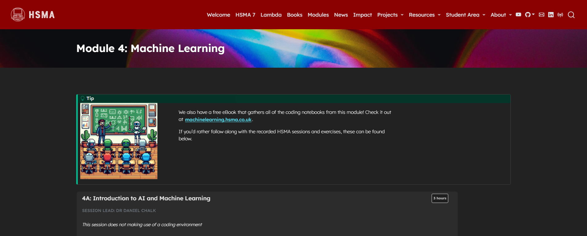

This module serves as an introduction to machine learning methods in Python. Students make use of packages including scikit-learn and tensorflow to train and assess machine learning models that can classify data into groups or predict a numeric value (e.g. length of stay).

It was delivered to the sixth cohort of the [Health Service Modelling Associates (HSMA) programme](/books_training/hsma_programme/index.qmd), a training course aimed at analysts, clinicians, managers and other people working in the NHS and related healthcare organisations.

It covers

- Key machine learning concepts, such as train-test splits, accuracy, the bias-variance trade-off, and more
- Preparing data for machine learning with one-hot encoding and feature engineering
- Machine learning ethics
- Tackling classification problems with machine learning
- Tackling regression problems (numeric predictions) with machine learning
- The theory of, and how to apply, a wide range of algorithms using the scikit-learn package: logistic regression, decision trees, random forests, XGBoost, LightGBM, and more
- Creating ensemble models
- Assessing the performance of machine learning models in classification and regression problems with accuracy, precision, recall, f1 score, confusion matrices, the receiver operating curve, the ROC AUC, and more
- How to explain the activity of black-box models with techniques such as individual conditional expectation (ICE) plots, partial dependence plots (PDPs), SHAP values, and more
- Calibrating models for obtaining prediction probabilities
- Optimising model parameters efficiently with grid search and the optuna framework
- Optimising the selected features with a range of feature selection approaches
- Creating neural networks for classification problems with the tensorflow package
- The principles of reinforcement learning
- Creating synthetic data with SMOTE

All slides, session recordings, code examples, exercises and exercise solutions are available to access on the module page, covering 30 hours of content.

## View the module

To view the module, click on the image above or go to <https://hsma.co.uk/hsma_content/modules/current_module_details/4_machine_learning.html>.

 

:::{.callout-tip}

The guided code examples from this module, which talk through the how and why of each step, are also collected in the HSMA machine learning notebooks:

<https://machinelearning.hsma.co.uk>

:::

:::{.callout-tip}

Brand new to Python? Consider starting with the HSMA book of Python first:

<https://python.hsma.co.uk>

:::
