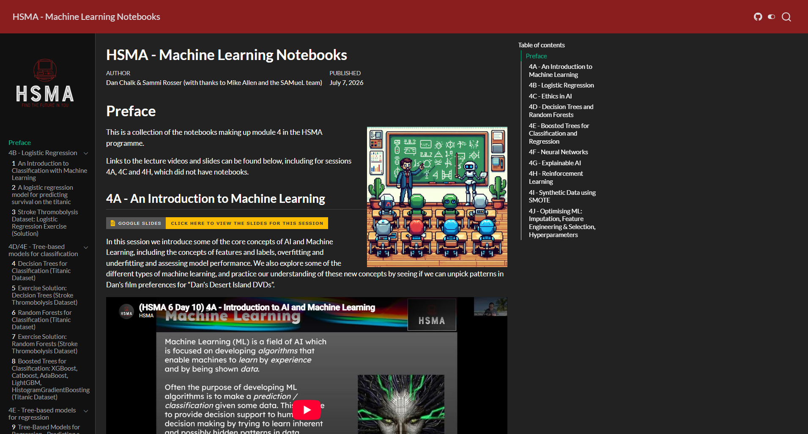

HSMA: Machine Learning Notebooks is a free online collection of the notebooks from the [machine learning module](/books_training/hsma_machine_learning_module/index.qmd) of the [Health Service Modelling Associates (HSMA) programme](/books_training/hsma_programme/index.qmd), with thanks to Mike Allen and the SAMueL team.

Rather than a book, it is a set of guided code examples that talk through the how and why of each step, giving you a library of code snippets to use when building your own machine learning projects. It covers:

- logistic regression
- tree-based models for classification and regression, including decision trees, random forests and boosted trees such as XGBoost and LightGBM
- neural networks with tensorflow
- explainable AI, including PDP, ICE and SHAP plots
- synthetic data
- calibrating and optimising models, including imputation, feature engineering, feature selection and hyperparameters

The examples are written in Python, mostly using the scikit-learn package, and include health datasets such as stroke thrombolysis data. Links to the lecture videos and slides are included for every session of the module, including those without notebooks.

## View the notebooks

To view the notebooks, click on the image above or go to <https://machinelearning.hsma.co.uk>.

 

:::{.callout-tip}

Brand new to Python? Consider starting with the [HSMA book of Python](/books_training/hsma_python_book/index.qmd) first:

<https://python.hsma.co.uk>

:::
