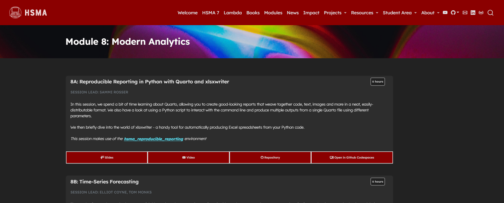

This module serves to introduce some additional techniques that are useful parts of the modern analyst's skillset.

We start with a session on reproducible reporting, exploring how we can create beautiful html, pdf and Word reports with Quarto. Quarto allows for code - and the output of code - to be interweaved with text, headings, images, videos, and much more. We explore standard document layouts as well as dashboard-style layouts, and cover a range of useful Quarto parameters and tips. With Quarto, we also look at automation and parameterisation of reports, exploring how to generate multiple reports just by running a simple Python script. The session also briefly covers xlsxwriter, for automatically producing Excel spreadsheets from your Python code.

In the final taught session of HSMA 6, we take a look at time-series forecasting methods. These methods take historical patterns and use them to predict the future. The session covers how to prepare data for forecasting, how to train simple models, how to assess your forecasts, and how to use the modern forecasting library Prophet, as well as when time-series forecasting methods are a good fit for your problems.

It was delivered to the sixth cohort of the [Health Service Modelling Associates (HSMA) programme](/books_training/hsma_programme/index.qmd), a training course aimed at analysts, clinicians, managers and other people working in the NHS and related healthcare organisations.

The time-series forecasting session was delivered by guest lecturers Elliot Coyne and Tom Monks.

All slides, session recordings, code examples, exercises and exercise solutions are available to access on the module page, covering 12 hours of content.

While it is intended to be run on your local machine using the supplied environment, some exercises can be completed online using the 'Open in GitHub Codespaces' links.

## View the module

To view the module, click on the image above or go to <https://hsma.co.uk/hsma_content/modules/current_module_details/8_modern_analytics.html>.

 

:::{.callout-tip}

Brand new to Python? Consider starting with the HSMA book of Python first:

<https://python.hsma.co.uk>

:::
