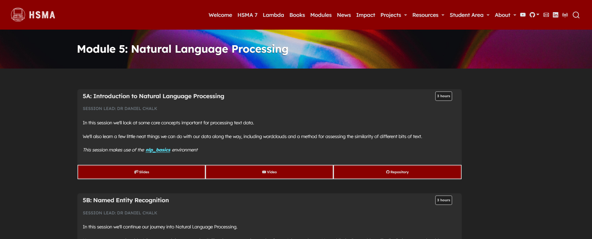

In this module we explore a range of techniques that can help to make sense of the reams of unstructured text-based data that exists in healthcare systems around the world.

Starting off with an overview of the terminology and key concepts of the field of natural language processing (NLP), we then work on processing some real text data and exploring the frequency of words and phrases within it, using this to create wordcloud visualisations of these texts.

We then move on to Named Entity Recognition (NER), exploring a library we can use to automatically recognise anything from people to places.

Finally, we move on to sentiment analysis - a technique more closely related to the machine learning work we did in module 4. We explore how to train a neural network that can identify whether a piece of text is positive or negative in tone, providing an insight into a flexible class of machine learning that can be used for other text classification tasks.

In HSMA 6, the module ended with a 6 hour hackathon in which students worked in their peer support groups on a natural language processing task of their choice. While there is no taught content for this session, the presentations given by the groups of their projects from the day are available to watch.

It was delivered to the sixth cohort of the [Health Service Modelling Associates (HSMA) programme](/books_training/hsma_programme/index.qmd), a training course aimed at analysts, clinicians, managers and other people working in the NHS and related healthcare organisations.

All slides, session recordings, code examples, exercises and exercise solutions are available to access on the module page, covering 15 hours of content.

## View the module

To view the module, click on the image above or go to <https://hsma.co.uk/hsma_content/modules/current_module_details/5_natural_language_processing.html>.

 

:::{.callout-tip}

The sentiment analysis session builds on the [HSMA machine learning module](/books_training/hsma_machine_learning_module/index.qmd), so you may find it helpful to complete that first.

:::

:::{.callout-tip}

Brand new to Python? Consider starting with the HSMA book of Python first:

<https://python.hsma.co.uk>

:::
