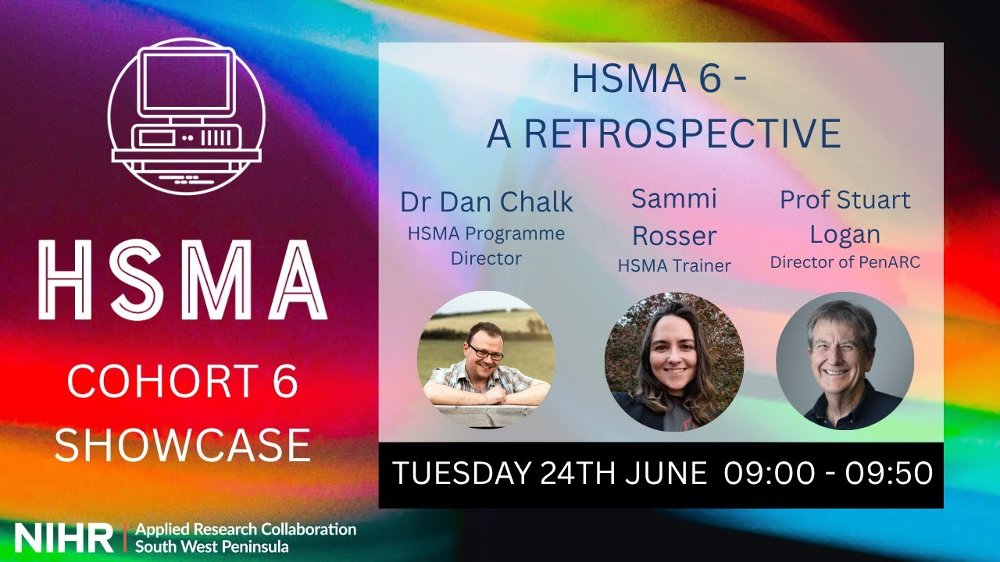

In the second phase of the [Health Service Modelling Associates (HSMA) programme](/books_training/hsma_programme/index.qmd), participants carry out a modelling or data science project for their own health, social care or policing organisation. At the end of each round, they present their projects at a showcase, and the recordings are published on the HSMA YouTube channel.

The projects tackle real-world problems using the techniques taught on the programme, such as:

* discrete event simulation of pathways, from emergency departments and urgent treatment centres to mental health and neurodevelopmental services
* machine learning and natural language processing, for example predicting admissions or non-attendance and analysing free text
* forecasting demand, from A&E attendances to excess mortality
* geographic modelling, for example of travel times and ambulance dispatch boundaries

Some showcases also include talks from HSMA alumni about what they have done since the programme.

More details about many of the projects, including links to their code where it is shared, can be found on the [HSMA website](https://hsma.co.uk/previous_projects/completed_projects.html).

## Search the project presentations

Search for a project by title, presenter, organisation or round. The most recent rounds are listed first. Where a recording covers several projects and its description gives the timings, each project is listed separately and the link starts the video at that project.

::: {#showcase-recordings}
:::

You can also browse the [HSMA 6](https://www.youtube.com/playlist?list=PLgHO2TgIJXdlwBbDGJqFBoh9qhjnKZVd6), [HSMA 5](https://www.youtube.com/playlist?list=PLgHO2TgIJXdl1MvfkwCGJ6n8_1EYCSzex), [HSMA 4](https://www.youtube.com/playlist?list=PLgHO2TgIJXdn0k4y56xtM-VpcHU_5RJUN) and [HSMA 3](https://www.youtube.com/playlist?list=PLgHO2TgIJXdnAWY7tGGPQLWYAjn0tgG_A) playlists on YouTube.

To search these recordings alongside talks, webinars and workshops from other communities, use the [Recordings Finder](/recordings/index.qmd).
