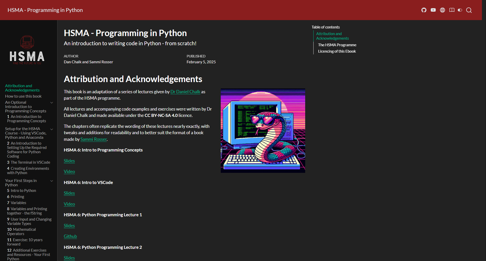

HSMA: Programming in Python is a free eBook written to accompany the [introductory module](/books_training/hsma_intro_programming_module/index.qmd) of the [Health Service Modelling Associates (HSMA) programme](/books_training/hsma_programme/index.qmd). It adapts Dr Daniel Chalk's HSMA lectures into book form.

The book is aimed at absolute beginners, including people who are brand new to programming in general. It takes you from "hello world" through to:

- data types, lists and dictionaries
- loops and conditional logic
- using and writing functions
- importing packages
- handling errors
- object oriented programming

It also includes a brief look at handling data with the numpy and pandas packages, and a quick introduction to creating static and interactive graphs.

The book is an important starting point before moving on to the other HSMA books, such as the [Little Book of Discrete Event Simulation](/books_training/hsma_little_book_of_des/index.qmd).

## View the book

To view the book, click on the image above or go to <https://python.hsma.co.uk>.
