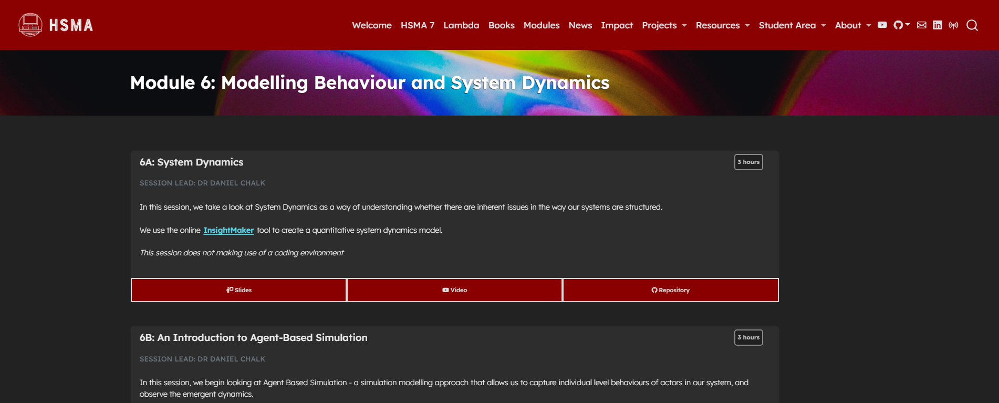

In this module, we explore two more techniques for modelling pathways and systems.

We kick off with system dynamics - a powerful tool for qualitative or quantitative (numeric) simulations of systems at a high level. System Dynamics excels at unpicking fundamental issues with the structure of systems. This session is codeless, using the online InsightMaker platform instead.

We then move onto agent-based simulation (ABS) - a simulation technique that is well-suited to instances where we are interested in the emergent behaviour of systems that comes from the interactions of and decisions of individuals. Commonly used in disease spread modelling, we explore how to write our own simulations using the MESA package, as well as digging into its possible applications in a more general healthcare context.

It was delivered to the sixth cohort of the [Health Service Modelling Associates (HSMA) programme](/books_training/hsma_programme/index.qmd), a training course aimed at analysts, clinicians, managers and other people working in the NHS and related healthcare organisations.

All slides, session recordings, code examples, exercises and exercise solutions are available to access on the module page, covering 12 hours of content.

## View the module

To view the module, click on the image above or go to <https://hsma.co.uk/hsma_content/modules/current_module_details/6_system_dynamics_agent_based_simulation.html>.

 

:::{.callout-tip}

Brand new to Python? Consider starting with the HSMA book of Python first:

<https://python.hsma.co.uk>

:::
