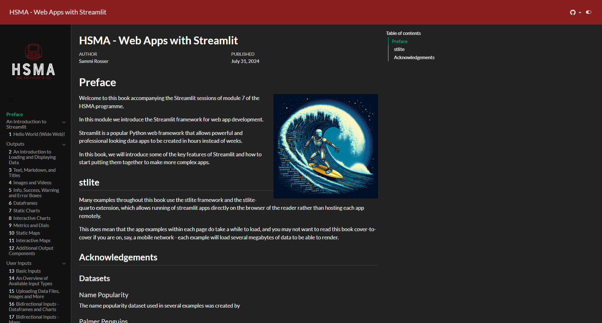

HSMA: Web Apps with Streamlit is a free eBook written to accompany the Streamlit sessions of the [open source collaborative development and web development module](/books_training/hsma_git_web_dev_module/index.qmd) of the [Health Service Modelling Associates (HSMA) programme](/books_training/hsma_programme/index.qmd).

It introduces Streamlit, a beginner-friendly Python web framework for creating interactive data apps, so that you can share your Python code with people in your organisation who don't use Python. The book covers:

- outputs, such as text, images, dataframes, charts, maps and metrics
- user inputs, including file uploads
- downloading outputs
- layout and styling
- controlling application flow
- advanced concepts, such as caching, session state and partial reruns
- deploying your app on a free hosting service
- a worked project building a web app for a discrete event simulation

Many of the examples use the stlite framework, which runs the example apps directly in your browser. This means the examples can take a while to load, and each one downloads several megabytes of data.

For more experienced Streamlit users, the book also works as a reference guide to individual techniques.

## View the book

To view the book, click on the image above or go to <https://webapps.hsma.co.uk>.

 

:::{.callout-tip}

Brand new to Python? Consider starting with the [HSMA book of Python](/books_training/hsma_python_book/index.qmd) first:

<https://python.hsma.co.uk>

:::
