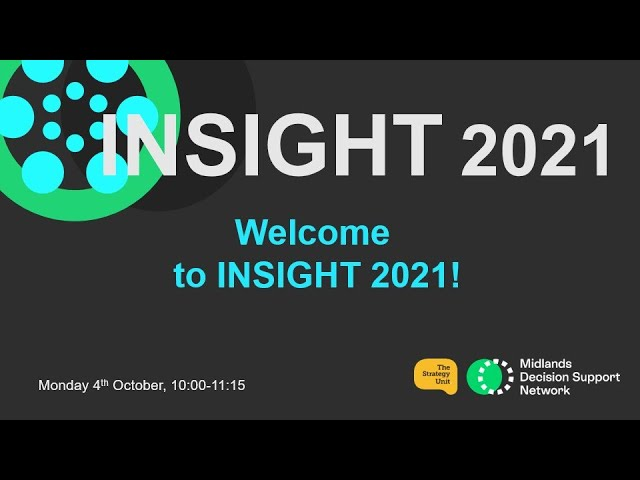

Insight is a festival of online events about analysis and decision-making in health and care, run by the [Midlands Decision Support Network](/books_training/mdsn_training/index.qmd) and hosted by [the Strategy Unit](https://www.strategyunitwm.nhs.uk/).

The first festival, Insight 2020, was held online from September to November 2020. Over six weeks, more than 30 events explored the challenges facing decision-makers in health and care, and how analysis can best inform their decisions, through a mix of talks, panels, workshops and conversations. Insight 2021 followed in October 2021.

The recorded events cover topics including:

* **Opening keynotes** - Ben Goldacre on open approaches to health data science, and Andi Orlowski on "dangerous analytics… and how local analysts can save you!"
* **COVID-19** - what the pandemic taught us about decision-making, social care, homelessness, the impact on children and young people, and making sense of emerging evidence
* **Health inequalities** - including health inequalities and ethnicity, and what we can learn from the pandemic to reduce them
* **Better decisions** - decision quality, decision-making toolkits, population involvement, and whether health and care systems should trust algorithms
* **Analysts and analytics** - the future of analytics, analytical priorities, what analysts bring to leadership, sharing your work, and a joint event with the NHS-R Community on why the NHS should use R
* **Analysis in practice** - end of life care analysis (including its data and code), population health management and evaluation

## Search the events

Search for an event by title, year or topic. Events are listed in the order they were published.

::: {#insight-events}
:::

You can also browse the [Insight 2020](https://www.youtube.com/playlist?list=PLFEXOtXX7YkkFkTe1fRum-cyWPWCf-YKO) and [Insight 2021](https://www.youtube.com/playlist?list=PLFEXOtXX7YkmJhpetyT5AIGyLWXsOlXyR) playlists on YouTube.

The Midlands Decision Support Network also publishes [recordings of its training courses](/books_training/mdsn_training/index.qmd) and of its [Analyst Network Huddles](/books_training/analyst_network_huddles/index.qmd).

To search these recordings alongside talks, webinars and workshops from other communities, use the [Recordings Finder](/recordings/index.qmd).
