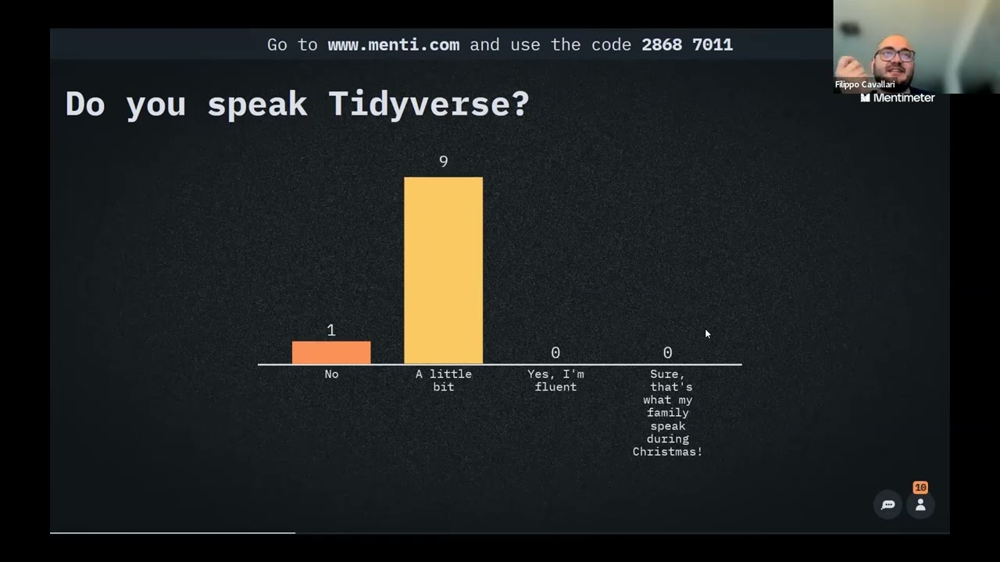

The Midlands Decision Support Network (MDSN) brings together the Decision Support Units of integrated care systems across the Midlands, to help them make high-quality strategic decisions. It is hosted by [the Strategy Unit](https://www.strategyunitwm.nhs.uk/), which also runs the network's [Analyst Network Huddles](/books_training/analyst_network_huddles/index.qmd) and a training and development programme for analysts and leaders.

In 2022 and 2023, recordings of many of the network's training courses were published on YouTube. Each course was taught live over several sessions, often two to five hours long, and the recordings can be followed at your own pace. The courses include:

* **Population health management** - a series covering an introduction to population health management (PHM), R and statistics for PHM, population segmentation, risk prediction and stratification, impactibility and causal inference, and evaluation
* **Health economics and evaluation** - led by the Health Economics Unit, covering the foundations of health economics, evaluating service change, critical appraisal of economic evaluations, decision modelling and equity in healthcare
* **Time-series forecasting and decision-making** - a three-session course, recorded twice
* **Machine learning** - the first two sessions of a five-session course, covering an introduction to machine learning and data preparation and feature engineering
* **Theory of constraints for patient flow** - a one-day course led by Alex Knight
* **Introduction to R Markdown** - a two-part course
* **Leadership development for analysts** - a session for the line managers of analysts on the leadership course

Some series are incomplete - for example, the second population health management session and the last three machine learning sessions aren't in the playlist.

## Search the sessions

Search for a session by title, course, year or topic. Sessions are grouped by course.

::: {#mdsn-training}
:::

You can also browse the full [MDSN Training playlist on YouTube](https://www.youtube.com/playlist?list=PLFEXOtXX7YkkHfQ8OdHu2eefgoree3TCX).

To search these recordings alongside talks, webinars and workshops from other communities, use the [Recordings Finder](/recordings/index.qmd).
