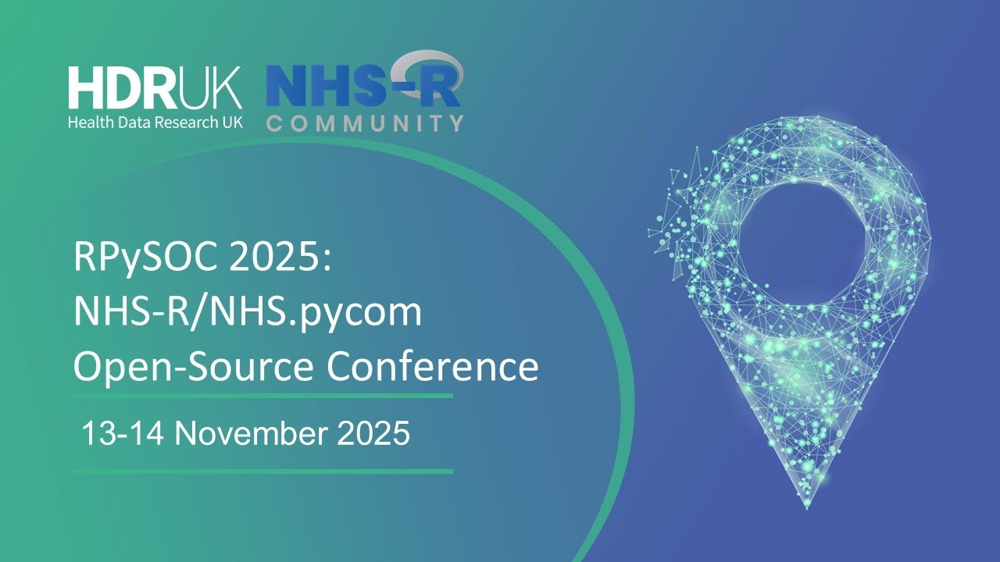

The [NHS-OA Community](/books_training/nhs_oa_community/index.qmd) runs an annual open source conference, previously the NHS-R Community Conference and now RPySOC, the NHS-R/NHS.pycom open source conference. Recordings of the talks, and in some years the workshops, are available on YouTube.

The talks are given by analysts and data scientists from across health and care, and showcase real-world projects using R, Python and other open source tools. For example, talks at RPySOC 2025 covered:

* discrete event simulation of non-elective admissions
* waiting list modelling with open data and open source code
* optimising the location of women's health hubs using travel time data
* reproducible data visualisation pipelines
* deploying Python in production
* adopting reproducible analytical pipelines (RAP) by default

## Search the conference talks

Search for a talk by title, speaker, year or conference. Where a recording covers several talks and its description gives the timings, the link starts the video at that talk.

::: {#conference-talks}
:::

## Conference playlists

Each conference has its own playlist:

| Conference | Playlists |
|------------|-----------|
| RPySOC 2025 | [Recordings](https://www.youtube.com/playlist?list=PLXCrMzQaI6c0kEKt4lN0659WQj_-SNUr_) |
| RPySOC 2024 | [Recordings](https://www.youtube.com/playlist?list=PLXCrMzQaI6c2vQUabRSOg9_FCxp6x6cVg) |
| NHS-R/NHS.pycom Conference 2023 | [Talks](https://www.youtube.com/playlist?list=PLXCrMzQaI6c2RjLQvFWpW_1QA68qylKb9), [Workshops](https://www.youtube.com/playlist?list=PLXCrMzQaI6c3vXRIOmgv8Qk9wYSoXatdt) |
| NHS-R Community Conference 2022 | [Recordings](https://www.youtube.com/playlist?list=PLXCrMzQaI6c3kFGGOuR432J8tUJq_VhWp) |
| NHS-R Community Conference 2021 | [Recordings](https://www.youtube.com/playlist?list=PLXCrMzQaI6c1R5K-iqHpOVDG0PelBA6uc) |
| NHS-R Community Conference 2020 | [Talks](https://www.youtube.com/playlist?list=PLXCrMzQaI6c0Kvs7lE-Rxdig5nc5-4Xx2), [Workshops](https://www.youtube.com/playlist?list=PLXCrMzQaI6c3EAh10hDZectzBALWPk19w) |

To find recordings from newer conferences, see the [NHS-OA Community's YouTube playlists](https://www.youtube.com/@NHSOA_Community/playlists).

The NHS-OA Community also publishes recordings of [webinars](/books_training/nhs_oa_webinars/index.qmd) and [workshops](/books_training/nhs_oa_workshops/index.qmd).
