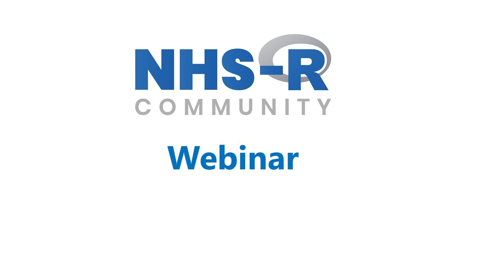

This YouTube playlist collects recordings of webinars run by the [NHS-OA Community](/books_training/nhs_oa_community/index.qmd), including those run when it was the NHS-R Community. Each webinar is a standalone session given by analysts, data scientists and other speakers from the NHS and beyond.

The webinars are mostly focused on R, and include:

* **tools and good practice** - such as Shiny, Quarto, Git and GitHub, writing R packages, unit testing, package management and reproducible environments with renv
* **analytical techniques** - such as time series forecasting, causal inference, statistical process control and statistical disclosure control
* **NHS case studies** - such as predicting emergency demand for beds, assessing the impact of COVID-19 on hip replacement rates, and modelling the consequences of emergency department admission delays

## Watch the webinars

To watch the webinars, click on the image above or go to the [webinar playlist on YouTube](https://www.youtube.com/playlist?list=PLXCrMzQaI6c36jqIWc9AgHzowzZ2ak9DL).

The NHS-OA Community also publishes recordings of [workshops](/books_training/nhs_oa_workshops/index.qmd) and [conference talks](/books_training/nhs_oa_conference_recordings/index.qmd).
