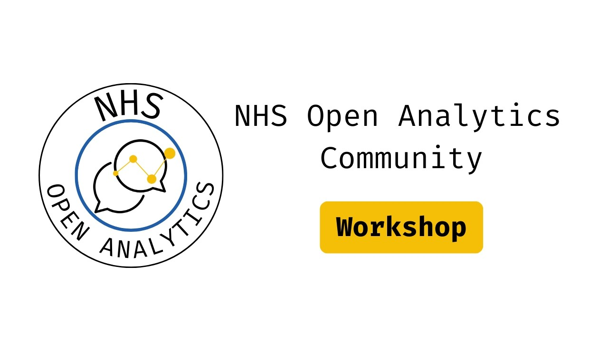

This YouTube playlist collects recordings of hands-on workshops run by the [NHS-OA Community](/books_training/nhs_oa_community/index.qmd), including those run when it was the NHS-R Community. The workshops were delivered live, often as part of the community's annual conference, and the recordings can be followed at your own pace.

The workshops are mostly in R. They include regular multi-part introductory and intermediate R courses, as well as one-off workshops on topics such as:

* data visualisation with ggplot2 and interactive plotting
* building apps with Shiny
* regression modelling and machine learning with tidymodels
* statistical process control charts and changepoint analysis
* working with databases
* reproducible reporting and automation, including R Markdown, targets and GitHub Actions
* code review and debugging

There is also an introduction to building interactive visualisations in Python with Shiny.

## Search the workshops

Search for a workshop by title, speaker, year or topic. Newest workshops are listed first. Where a recording's description gives timings for its sections, each section is listed separately and the link starts the video at that section.

::: {#workshop-recordings}
:::

You can also browse the full [workshop playlist on YouTube](https://www.youtube.com/playlist?list=PLXCrMzQaI6c2L4JCRaF2iujzBxe9Rk-rC).

The NHS-OA Community also publishes recordings of [webinars](/books_training/nhs_oa_webinars/index.qmd) and [conference talks](/books_training/nhs_oa_conference_recordings/index.qmd).

To search these recordings alongside talks, webinars and workshops from other communities, use the [Recordings Finder](/recordings/index.qmd).
