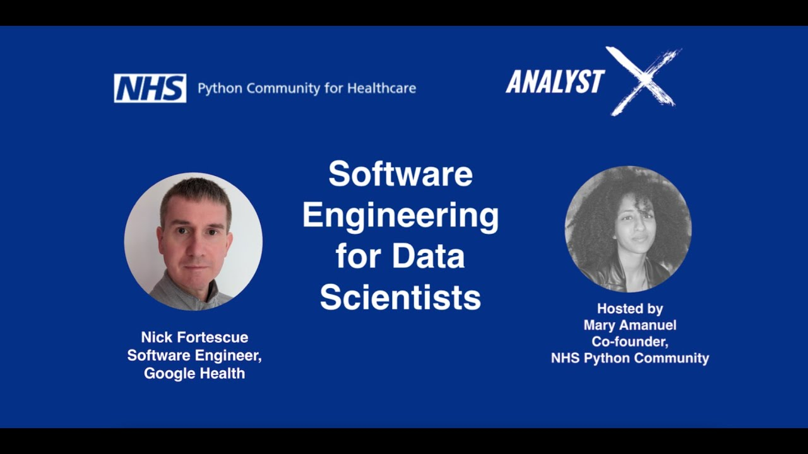

The NHS Python Community (NHS.pycom) promoted the use of Python and open source code in the NHS and wider healthcare sector, and has since become part of the [NHS-OA Community](/books_training/nhs_oa_community/index.qmd). Its YouTube channel has recordings of its own events, including:

* **Show-and-tell sessions** - such as *Python in the Clinic* and *Saving life and learning from death with Python*, where clinicians and analysts shared projects using Python
* **Introductions to Python and machine learning** - such as an introduction to Python for data analysis and data science, and the basics of machine learning
* **Talks on good practice** - such as software engineering for data scientists, and reproducible analytical pipelines (RAP)
* **Joint events with the NHS-R Community** - such as NHS.Pycom X NHS-R in February 2022

Recordings of the Python track of the 2022 NHS-R Community Conference are listed with the [NHS-OA Community's conference recordings](/books_training/nhs_oa_conference_recordings/index.qmd) instead.

## Search the talks

Search for a talk by title, speaker, year or topic. Newest talks are listed first.

::: {#pycom-talks}
:::

You can also browse all of the videos on [NHS.pycom's YouTube channel](https://www.youtube.com/%40nhs-pycom/videos).
