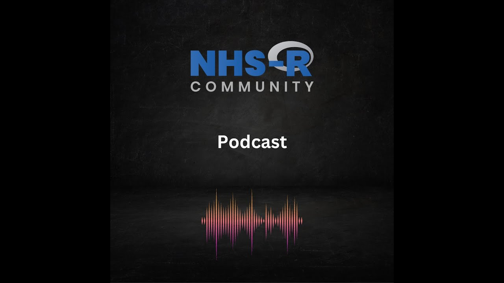

The NHS-R Podcast was made by the NHS-R Community, now the [NHS-OA Community](/books_training/nhs_oa_community/index.qmd), and first released on [SoundCloud](https://soundcloud.com/nhs-r-community) from 2022. The episodes have since been uploaded to YouTube, with automatic subtitles that have been checked and edited by hand.

The episodes feature people from across the community talking about their work and experiences:

* **Episode 0** - a pilot episode in which Chris Beeley and Tom Jemmett talk about R, its uses, and their experiences of learning it
* **Episode 1** - the history of R, the NHS-R Community and its conferences, with Professor Mohammed Mohammed, Paul Stroner, Sarah Culkin, Jenny Morgan, Ellen Coughlan and Chris Beeley (in two parts)
* **Episode 2** - Chris Beeley talks to the Public Health England team behind the COVID-19 dashboard
* **Episode 3** - Chris Beeley talks to Andreas Soteriades about a text mining project for Friends and Family Test feedback

## Episodes

::: {#podcast-episodes}
:::

The NHS-OA Community also publishes recordings of [webinars](/books_training/nhs_oa_webinars/index.qmd), [workshops](/books_training/nhs_oa_workshops/index.qmd) and [conference talks](/books_training/nhs_oa_conference_recordings/index.qmd).

To search these recordings alongside talks, webinars and workshops from other communities, use the [Recordings Finder](/recordings/index.qmd).
