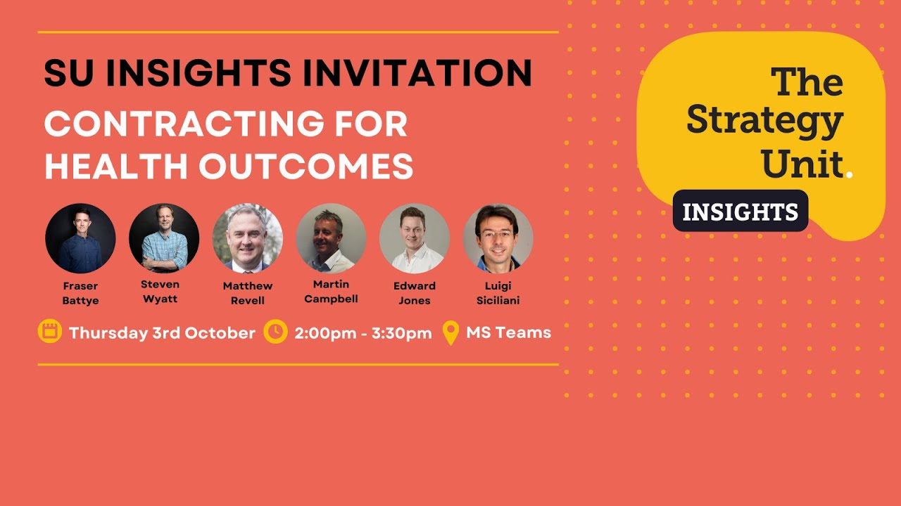

[The Strategy Unit](https://www.strategyunitwm.nhs.uk/) is an NHS team that provides analysis, evaluation and strategy support to health and care organisations, hosted by NHS Midlands and Lancashire. As well as running the [Midlands Decision Support Network](/books_training/mdsn_training/index.qmd), it publishes recordings of many of its webinars on YouTube, including:

* **SU Insights** - discussions of current issues in health and care with expert panels, such as contracting for health outcomes, the downsides of digital, and the Neighbourhood Insights series on neighbourhood health
* **National Neighbourhood Health Implementation Programme (NNHIP) evaluation and analysis community of practice** - drop-in sessions on measuring and analysing neighbourhood health, such as the Neighbourhood Index and opportunities to shift care out of hospitals
* **ICS intelligence functions** - webinars from 2022 in which integrated care systems shared what they had learned from developing their intelligence functions
* **Decision Support Units** - webinars from 2021 on the progress of the Midlands Decision Support Units and their analysis of inequalities, including in access to planned care and in children and young people's mental health
* **Population health management** - the Midlands Population Health Management Academy's webinar series, with speakers including Professor Sir Muir Gray, Professor Al Mulley and Professor Mohammed Mohammed, and introductions to methods such as logic models, qualitative methods and using evidence
* **End of life analysis** - walkthroughs of the Strategy Unit's 2020 report on healthcare use in the last two years of life

## Search the webinars

Search for a webinar by title, speaker, year, series or topic. The most recent series are listed first.

::: {#su-webinars}
:::

You can also browse all of the playlists on [the Strategy Unit's YouTube channel](https://www.youtube.com/channel/UCXu4WE5N-S9iWhKRMAYTZsA/playlists).

The Strategy Unit's other recordings are listed separately in the Atlas: [Midlands Decision Support Network training](/books_training/mdsn_training/index.qmd), the [Insight festival](/books_training/insight_festival/index.qmd), the [Analyst Network Huddles](/books_training/analyst_network_huddles/index.qmd), and training on the [New Hospital Programme Demand Model](/packages_projects_tools/new_hospital_programme/index.qmd).

To search these recordings alongside talks, webinars and workshops from other communities, use the [Recordings Finder](/recordings/index.qmd).
