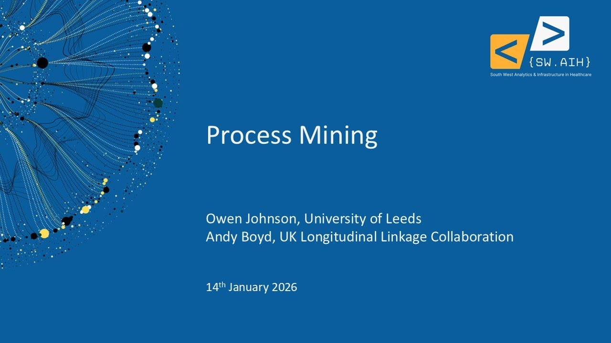

SWAIH (South West Analytics and Infrastructure in Healthcare) is a regional network for analysts, researchers and others using health and care data across the South West of England. In its own words:

> SWAIH is a network that hosts meetings, workshops and online talks for people working with healthcare data for research in the South West.

SWAIH began in late 2022, prompted by the Goldacre review, the *Data Saves Lives* strategy and the creation of regional Secure Data Environments for the NHS. The University of Exeter hosts it, and its funders and supporters are the NIHR Applied Research Collaboration South West Peninsula (PenARC), the NIHR Exeter Biomedical Research Centre, Health Data Research UK and the Great Western Secure Data Environment.

SWAIH runs:

* **an annual meeting** - held since 2024, most recently in July 2026 at Sandy Park, Exeter
* **Insight Talks** - described as "regular online talks, including discussions and Q&As"
* **the SW Data Science Hub** - "a focused in-person group for analysts and data leads to learn and work together across Cornwall, Devon and Somerset", which meets monthly at the University of Exeter and offers training in Python, R, GitHub, simulation, forecasting, process mining and more

You can join the mailing list or get in touch through the [SWAIH website](https://sites.google.com/nihr.ac.uk/swaih/home).

## Recordings

Recordings of SWAIH's Insight Talks are available on YouTube. They include:

* **health data infrastructure** - such as the SAIL Databank, the One Devon Dataset, the OMOP Common Data Model, the UK Health Data Research Alliance and the South West Secure Data Environment
* **data science in the NHS** - such as introducing data science and open methods into NHS teams, and using data science to improve NHS performance
* **analytical methods and tools** - such as process mining (with a follow-up workshop), modelling patient flow between acute, community and social care, and OpenPrescribing.net
* **careers and skills** - such as the National Competency Framework for health data analysts, and NIHR Academy funding for data science careers

### Search the talks

Search for a talk by title, speaker, year or topic. Newest talks are listed first.

::: {#swaih-talks}
:::

To search these recordings alongside talks, webinars and workshops from other communities, use the [Recordings Finder](/recordings/index.qmd).
