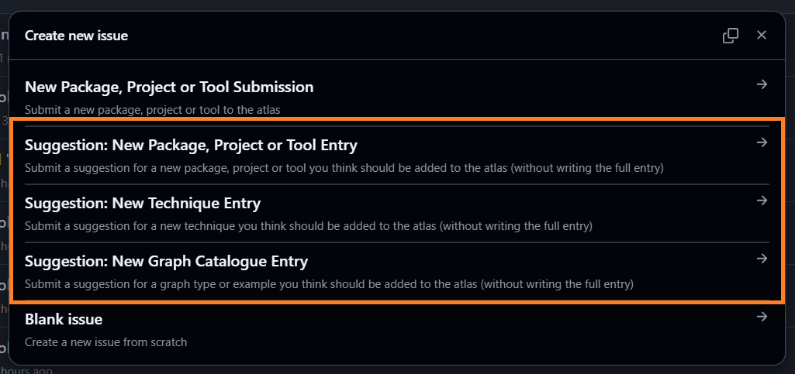
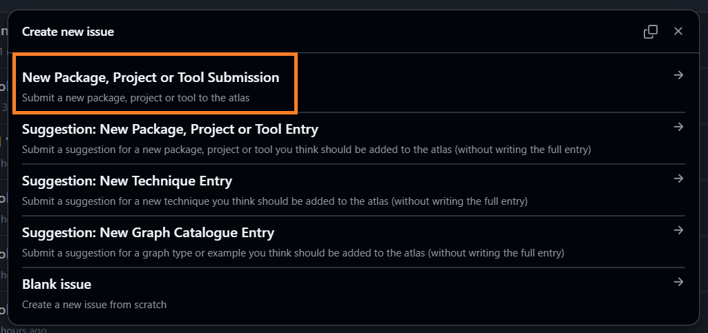
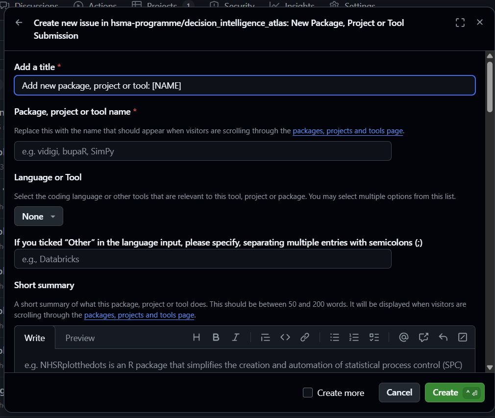

There are lots of ways to contribute to the Atlas - and many don't involve code or a lot of your time!

We want - and need - this to be a project written for the community, by the community. So please don't be afraid to get stuck in - we're a friendly bunch and want to make the contribution process as easy as possible.

## Submit an idea for an entry

Heard of a project, package or tool you think the Atlas should showcase?

Think there's a graph type you think should be shared with the community? Even better, do you have a reproducible code snippet to make that graph?

Or what about an advanced analysis, data science or operational research technique you think we should include?

You don't have to write the full thing - just [submit an issue](https://github.com/hsma-programme/decision_intelligence_atlas/issues/new/choose) on the Atlas's GitHub repository.

Don't worry about accidentally submitting a duplicate - we'd rather hear about something ten times than not at all! But if you'd like to take a look, you can see all of the currently proposed entries in our GitHub project.

[Click here to open the list of proposed Atlas entries in a new tab](https://github.com/orgs/hsma-programme/projects/2/views/7).

## Write an entry

### Without code

Want to write some entries for us, but not confident working with GitHub and Quarto (the framework we build the site with)? No problem! We have a totally code free route to writing Atlas entries.

Follow [this link](https://github.com/hsma-programme/decision_intelligence_atlas/issues/new/choose) to submit an issue on the Atlas's GitHub repository.

Choose 'New Package, Project or Tool Submission'

You'll then be provided with a form to gather the information we need to create a new Atlas entry - no code required.

This form is also the route for submitting books, courses, other training resources and communities - just choose the 'Courses and Training or Reference Materials' category, plus one of 'Books', 'Courses', 'Interactive Learning Tools', 'Reference Sites', 'Recorded Talks' or 'Communities' (and 'General Open Analytics' for books that aren't specific to healthcare, or 'Paid Resources' for books that aren't free to read, and 'Synchronous' and/or 'Asynchronous' for courses that are taught live or are self-paced), and your entry will be added to the [Books, Training and Communities](/books_training/index.qmd) page.

With a bit of GitHub actions wizardry, your form will be translated into the format the website need. A member of the Atlas team will then review this file and make any necessary tweaks before incorporating it into the site.

:::{.callout-note}
At the moment, it's only possible to contribute a package, project, tool, book, training resource or community in this way.

We may add the option to contribute techniques or graph catalogue entries in this way in the future - check back or let us know if this is something you'd be interested in.
:::

### With code

Like working with Quarto, or want to give it a try?

Head over to the [instructions in our GitHub readme](https://github.com/hsma-programme/decision_intelligence_atlas?tab=readme-ov-file#advanced-option-contributing-a-qmd-file) for details of how you can contribute to the Atlas via making a pull request on GitHub.

## Add a collection of recordings

The Atlas lists recordings of conference talks, webinars, workshops and lectures from across the health and care analytics community. Each collection has its own entry in the 'Recorded webinars and conference talks' section of the [Books, Training and Communities](/books_training/index.qmd) page, and they are all brought together in the searchable [Recordings Finder](/recordings/index.qmd).

The recordings are pulled automatically from YouTube playlists, and refreshed every month, so once a playlist has been added, new videos in it will appear in the Atlas without anyone having to update it.

### Without code

Know of a YouTube playlist or channel with recordings that would be useful to people working in healthcare analytics? [Submit an issue](https://github.com/hsma-programme/decision_intelligence_atlas/issues/new/choose) on the Atlas's GitHub repository with a link to it, and a sentence or two about who publishes the recordings and what they cover. We'll take it from there.

### With code

Adding a playlist to an existing collection, or a new collection of recordings, only takes a few lines in a configuration file. A collection can have its own entry, or be added to an existing one - for example, a table of training videos on the entry for the tool they teach. See the [instructions for adding YouTube recordings in our GitHub readme](https://github.com/hsma-programme/decision_intelligence_atlas?tab=readme-ov-file#adding-youtube-recordings) for details.

You don't need a YouTube API key of your own to contribute. The videos' details are fetched by a GitHub Action that uses the Atlas's own key, stored securely in the repository. It runs every month, and maintainers can also run it by hand from the repository's Actions tab.

If you'd like to fetch the videos yourself, you'll need a free YouTube Data API key - the readme explains how to get one and how to set it up as an environment variable. Please keep your key secret: never commit it to the repository or paste it into issues, pull requests or chat tools.

## Contributor Code of Conduct

We want the Atlas to be a friendly and welcoming project for all people, regardless of your background or level of coding expertise.

Please take a look at our code of conduct below:

:::{.callout-tip appearance="simple"}



:::
