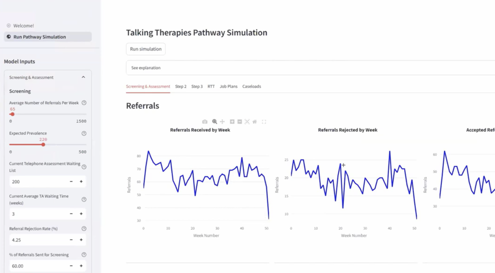

"This project is a discrete event simulation designed to model the flow of CYP through the newly designed ADHD diagnostic pathway.

The model is run via a streamlit app that is called by running the app.py file

The DES has various parameters that the user can change such as:

* The number of appointment slots available for that activity
* The % of patients that will get rejected at each stage
* The cut off time for forms and/or assessments to be returned"

([source](([source](https://nhsd-ndrs.shinyapps.io/cancer_treatments/))))

Screenshot of the app:

## Video

This project was developed as part of the Health Services Modelling Associate (HSMA) programme round 6. This is presentation from showcase:

