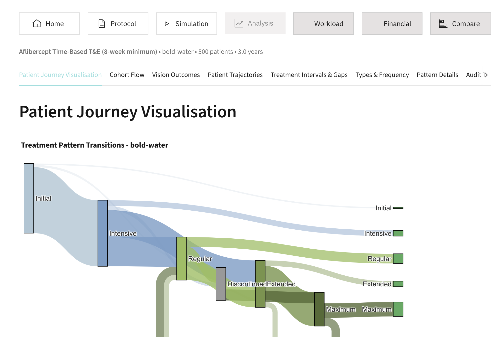

"This project aims to develop a comprehensive and flexible simulation model to optimise anti-VEGF treatment strategies in ophthalmology. The model will address the complex challenges in anti-VEGF treatments, including frequent injections, multiple treatment options, and diverse strategies, whilst considering the significant resource consumption and high costs associated with these treatments.

Key features of the project include:

* Dual modelling approach using Mesa and SimPy frameworks to determine the most suitable platform.
* Modular design to accommodate various treatment strategies, drug efficacies, and clinic capacities.
* User-friendly interface with interactive dashboards for stakeholders to explore different scenarios.
* Analysis of clinical effectiveness, costs, and resource requirements for various treatment approaches.
* Adaptability to incorporate new drugs and treatment paradigms as they emerge.
* Project Objectives: The project aims to provide a tool for data-driven decision-making in ophthalmology clinic management, potentially improving patient outcomes whilst optimising resource use and costs."

([source](([source](https://hsma.co.uk/previous_projects/hsma_6/H6_6007_Modelling_eye_injection_pathways/index.html))))

Screenshot from the web app:

## Video

This project was developed as part of the Health Services Modelling Associate (HSMA) programme round 6. This is presentation from showcase:

