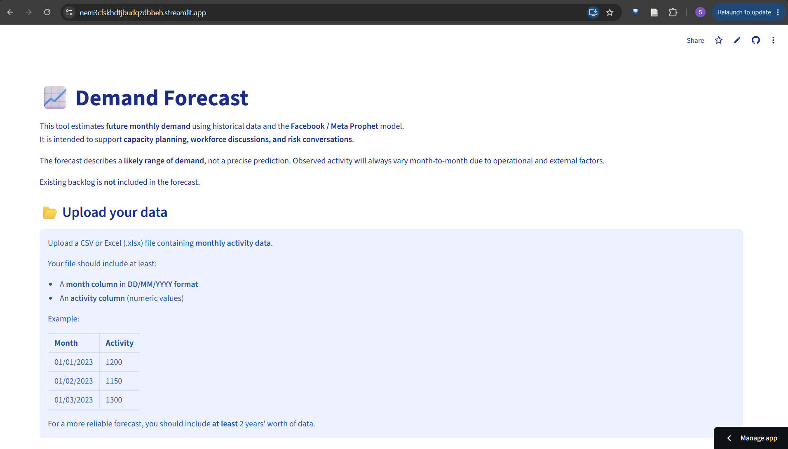
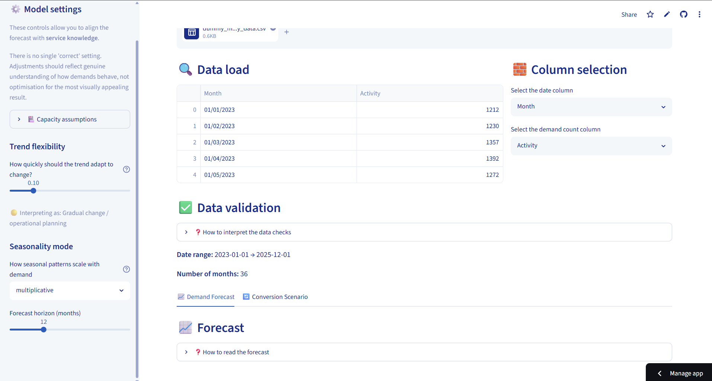
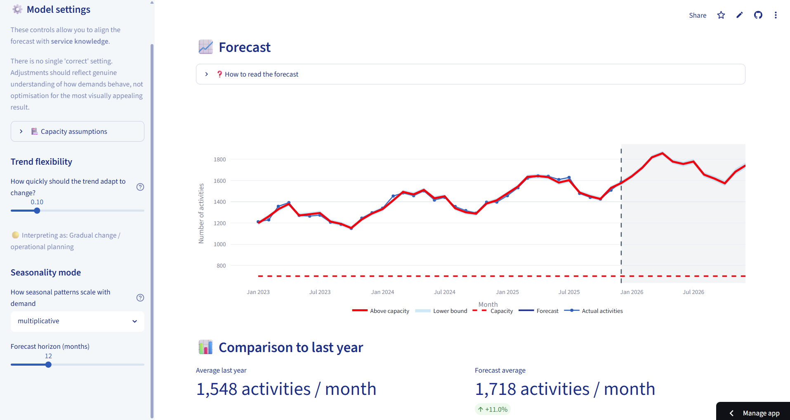

This tool is a Streamlit-based application designed to support demand forecasting and capacity planning using the Facebook Prophet time series model. It enables users to upload structured activity data (typically monthly referrals or service volumes) and generate forward projections with minimal setup, making it suitable for operational and planning contexts.

Once data is uploaded, the tool fits a time series model and produces a range of outputs that help users understand both future demand and its implications. Core outputs include:

- **Forecast visualisation:** A time series chart showing historical data, projected demand, and uncertainty intervals
- **Trend and seasonality views:** Decomposition of demand into long-term trend and recurring patterns (e.g. annual seasonality)
- **Summary narrative:** Automatically generated interpretation explaining expected changes in demand, including both overall growth and comparison to recent activity
- **Capacity analysis:** Overlay of user-defined capacity thresholds to identify when demand may exceed available capacity
- **Risk metrics:** Quantification of periods above capacity, estimated unmet demand, and required capacity to avoid breaches

The tool also supports scenario testing, allowing users to explore how changes such as altered referral patterns or conversion rates could impact future demand. 

Outputs can be exported as a standalone HTML report with embedded interactive charts and narrative summaries, enabling easy sharing of insights.

Overall, the tool bridges the gap between raw data and operational planning, enabling users to move beyond static spreadsheets toward more dynamic, evidence-based forecasting.
