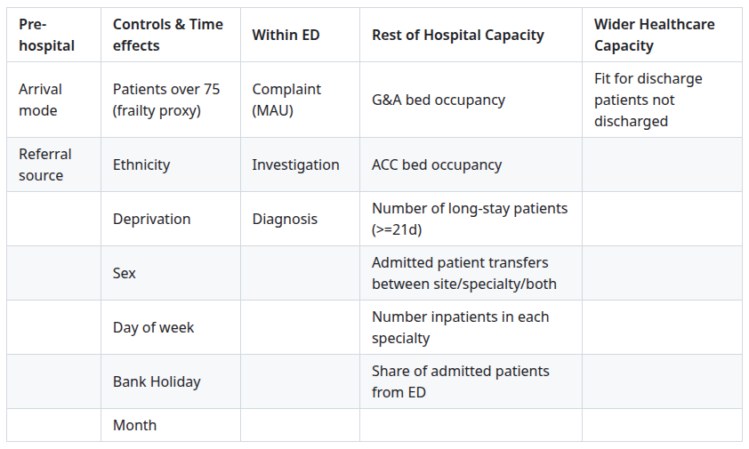
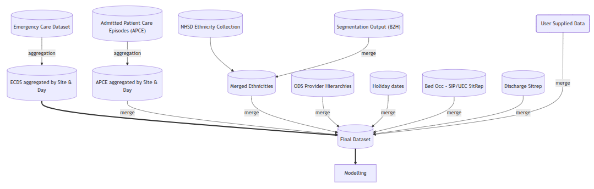

`ESA_ED_Crowding` is an **R package** developed by NHS England's Economics and Strategic Analysis (ESA) Team to explore Emergency Department (ED) crowding.

Crowding is measured in terms of:

* Number of patients staying at ED.
* Number of patients staying longer than 6 hours at ED.
* Number of majors and resus patients staying in the ED per cubicle.

The analysis isolates the impact of different factors on crowding including:

Data sources used include:

