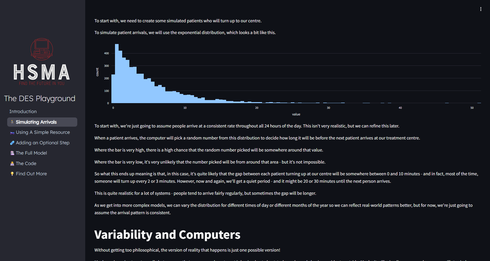
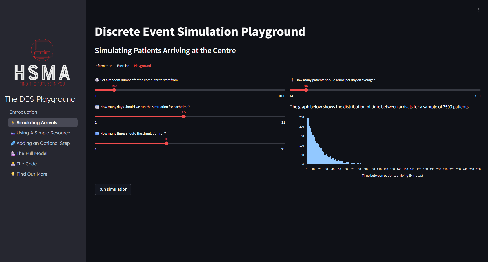
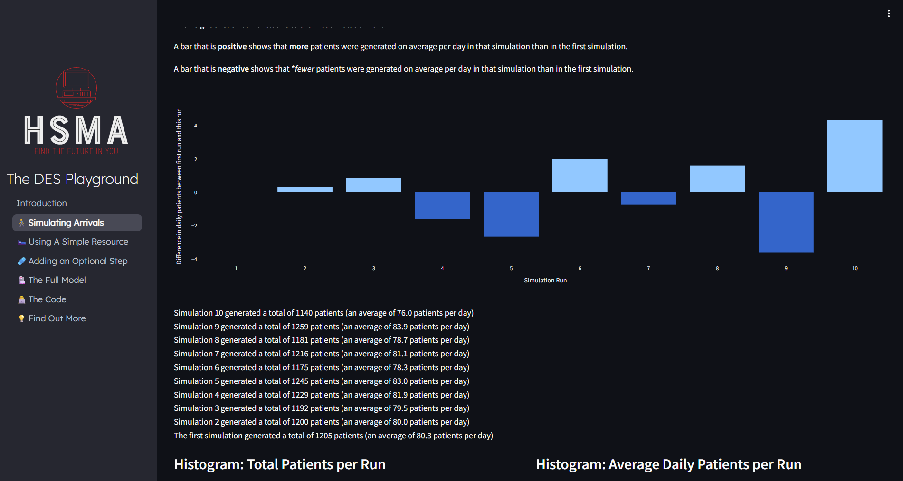
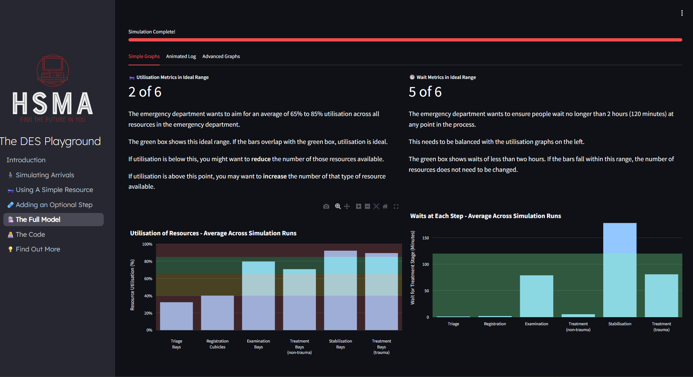
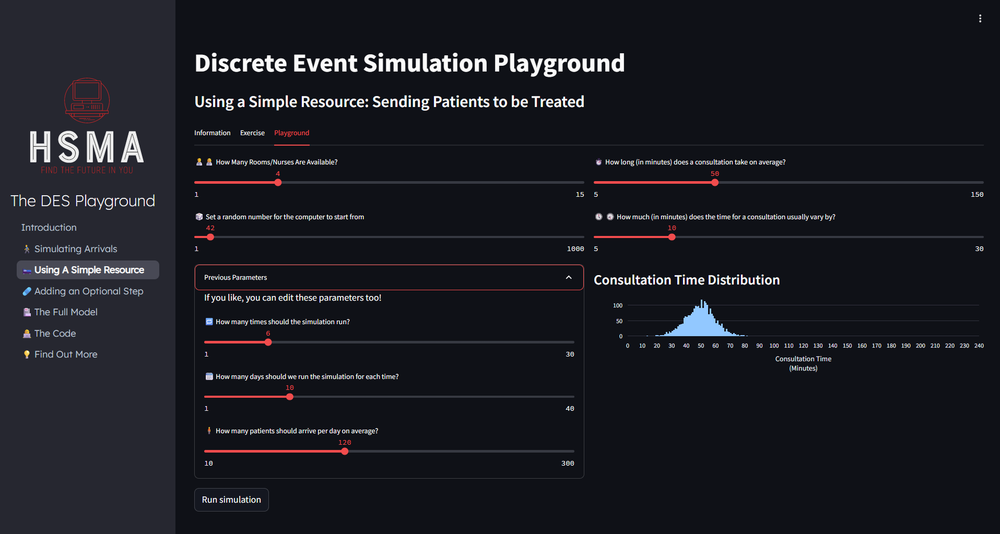
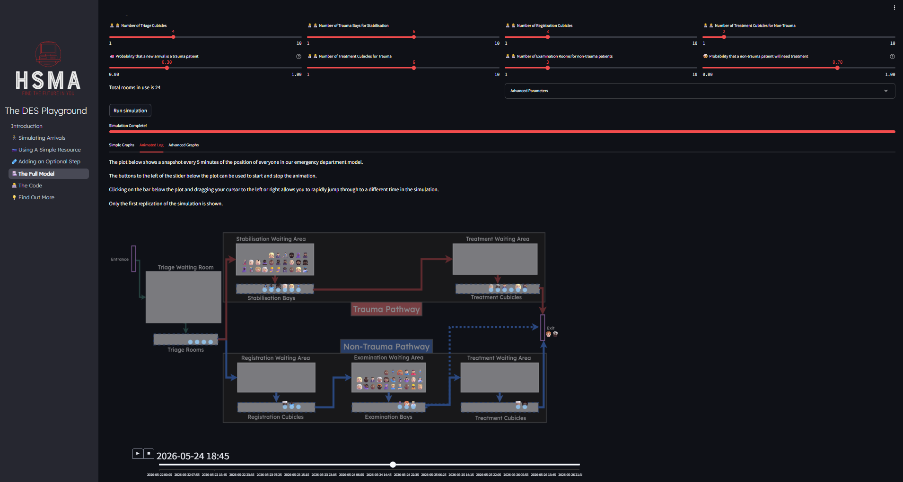

The Health Service Modelling Associates (HSMA) programme provides a Discrete Event Simulation playground, introducing some of the key concepts of DES.

Beginning with exploring how we can realistically simulate variable arrivals...



It allows you to then explore the impact of changing parameters...



Providing you with a range of interactive outputs to explore.





It then walks you through adding additional complexity to the model, talking through resources, multi-step pathways and optional steps.



It also provides a visual, intuitive demonstration of DES with the vidigi package.



You can try it out below, or click [here](https://playground.hsma.co.uk) to open the playground in a new window.

```{=html}
<iframe width='1000' height='700' src='https://playground.hsma.co.uk' title='HSMA DES Playground'></iframe>
```

:::{.callout-tip}
Has this piqued your curiousity? Head over to the [Atlas entry on DES](/techniques/des/index.qmd) to find out more, including a range of training materials and health service models.
:::
