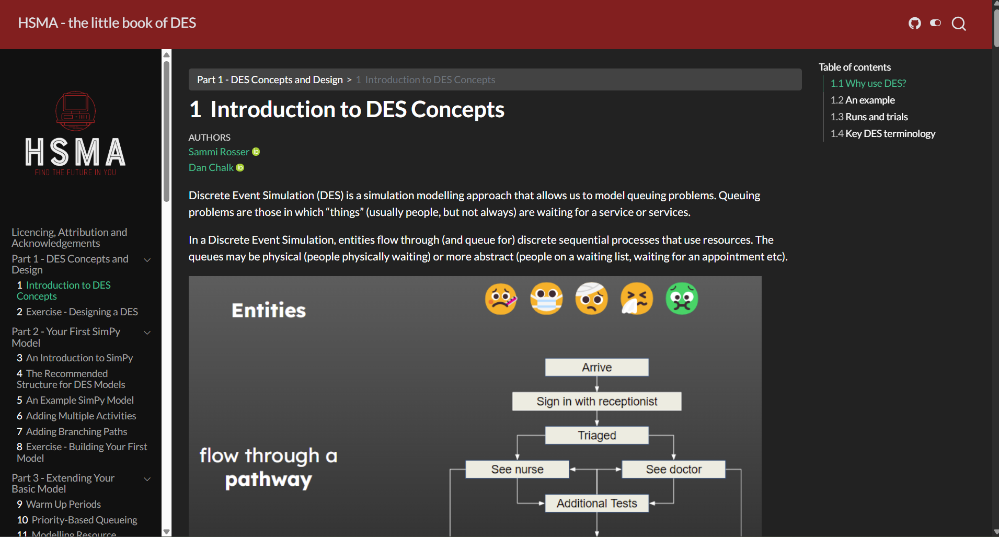

The Little Book of DES is a free eBook written to accompany the Discrete Event Simulation (DES) module of the [Health Service Modelling Associates (HSMA) programme](https://hsma.co.uk).

The book takes you from being a complete beginner in discrete event simulation through to creating complex models with a web interface, all using free packages in Python.

Primarily focussing on the SimPy package, the book begins with the concepts underpinning DES before moving on to advanced topics including:

- model testing
- ensuring reproducibility
- variable arrival rates
- parameterising your model from real-world data
- working with multiple patient/entity types

and much more!

## View the book

To view the book, click on the image above or go to <https://des.hsma.co.uk>.

 

:::{.callout-tip}

Brand new to Python? Consider starting with the HSMA book of Python first:

<https://python.hsma.co.uk>

:::
