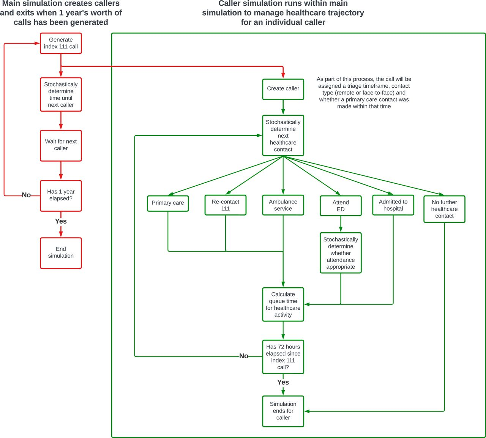
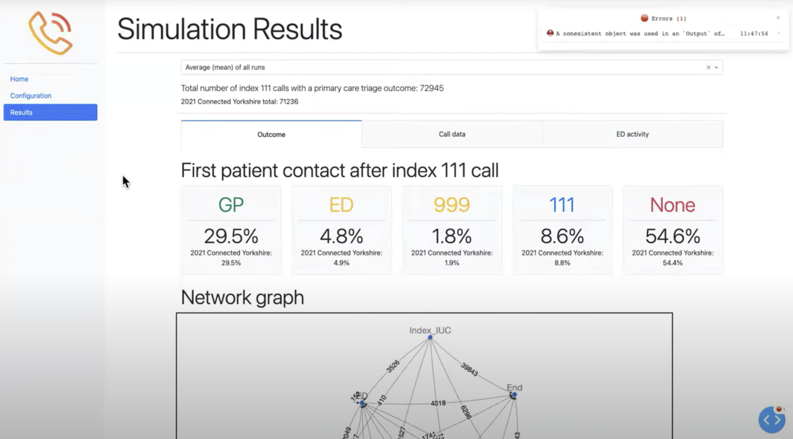

This study uses discrete event simulation to model the healthcare journeys of patients triaged to primary care following an NHS 111 call, estimating how timely primary care contact would affect subsequent 999 calls, Emergency Department attendances, and inpatient admissions.

The work showed that timely primary care contact could reduce 999 calls and ED attendances but would require nearly doubling primary care services.

The simulation is created using SimPy, and there is a Plotly Dash dashboard for running the simulation (with Docker environment for running it provided).

## Model structure

## Presentation

This project was developed as part of the Health Services Modelling Associate (HSMA) programme round 4. This is presentation from showcase:



## Screenshot from the web app

