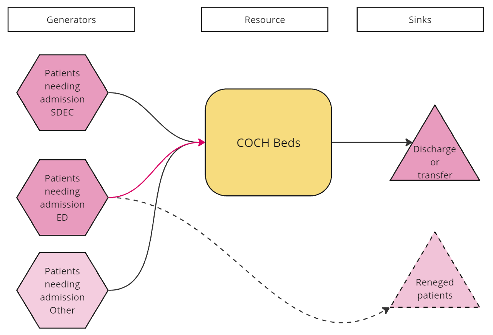

Non-Elective-Flow-Simulation is a Python discrete event simulation model and interactive Streamlit app developed by Countess of Chester Hospital NHS Foundation Trust. It allows users to test scenarios around bed numbers and admitted length of stay, and explore impact on ED waiting times and other targets.

Poor patient flow is leading to long waits for admission in Emergency Departments. This means there is poor performance against all the key ED wait metrics for the hospital and more importantly, there is evidence that long waits for admission in ED are associated with poorer outcomes for patients.

The two main strategies employed to tackle this problem is

* Increasing the number of beds (by creation of escalation beds)
* Trying to decrease discharge delays (reducing length of stay).

Additionally, with the Same Day Emergency Care (SDEC) facility, it is unclear how the number of people admitted through this facility impacts the waits of those in ED.

This projects aimed to answer questions such as:

* Given x beds, how far does admitted length of stay have to reduce to meet particular waiting time targets for those queuing in ED? (Evidence based target)
* If we open 15 beds but keep admitted length of stay the same, what is the impact on ED waiting times and the various targets? (Evidence for a particular management strategy)
* What is the optimum number of people to stream from ED to SDEC to minimise ED waits? (Evidence for a particular management strategy)

Model diagram:

## Talks


