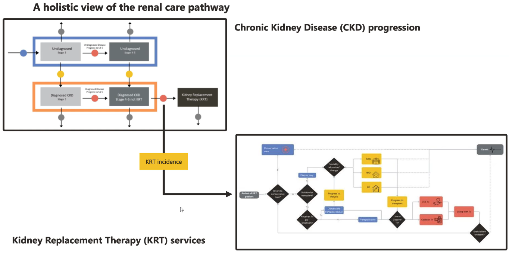
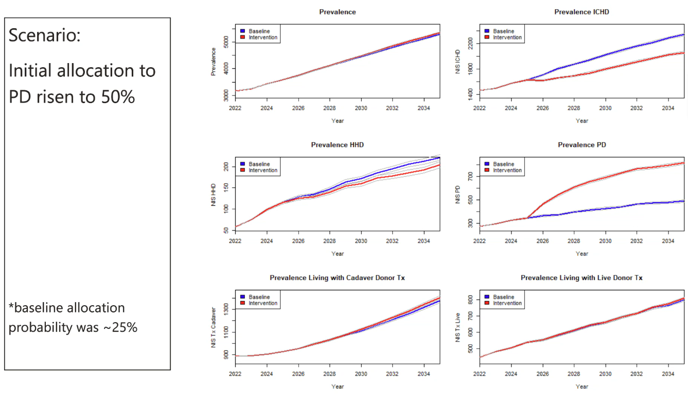

This model was developed by the Strategy Unit in collaboration with the Midlands Renal Operational Delivery Network (MRODN).

It is an open-source sequential SD-DES hybrid model of renal care with two components:

* A [system dynamics (SD) model](https://github.com/hsma-programme/decision_intelligence_atlas/issues/182) of CKD progression.
* A discrete-event simulation (DES) model of Kidney Replacement Therapy (KRT) patient pathways for capacity planning.

Hybrid model:

Modelling objectives:

1. How might demand change over time?
2. What does that mean for capacity for renal services?
3. Use scenarios to model the ability to mitigate future demand

DES is used to model the KRT pathway and is created using Python (SimPy).

Example of scenarios explored:

