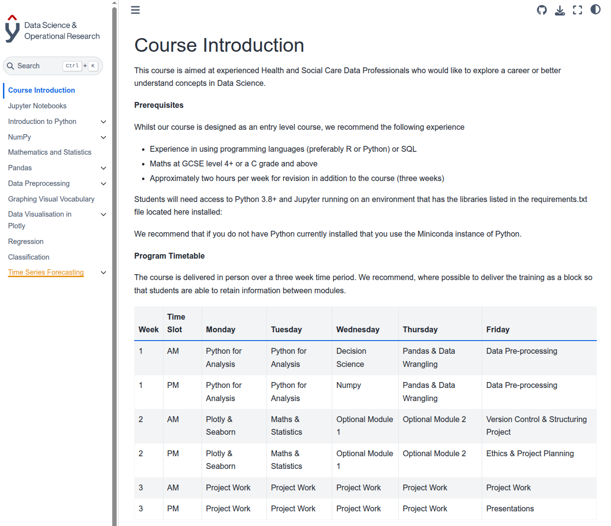

Python course developed by team at Somerset NHS Foundation Trust. It covers:

* Introduction to Notebooks
* Introduction to Python
* Introduction to NumPy
* Mathematics for Data Science
* Introduction to Pandas
* Data Preprocessing
* Classification and Regression
* Introduction to Time Series

